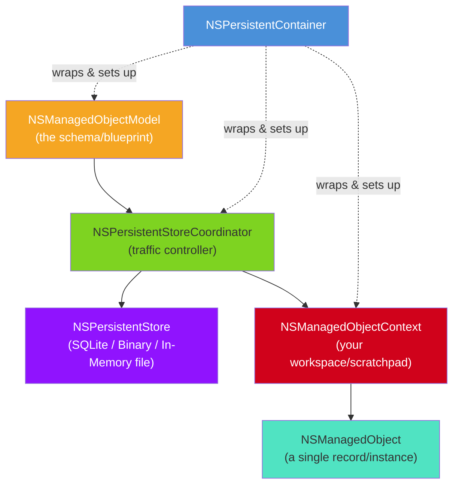
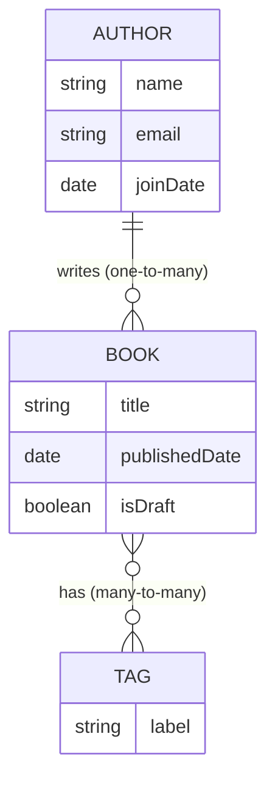
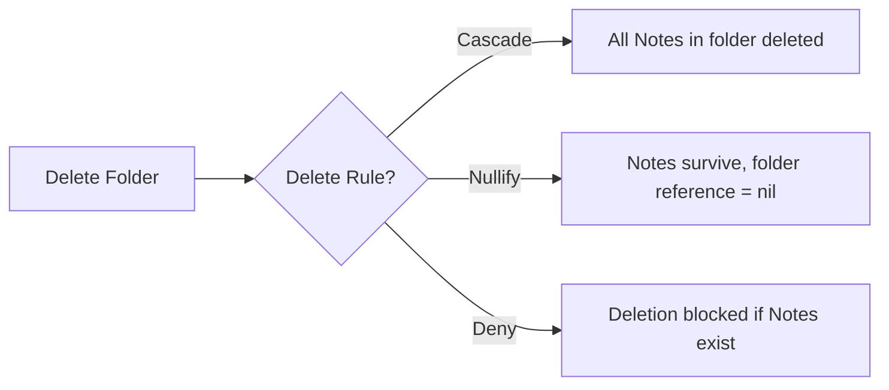
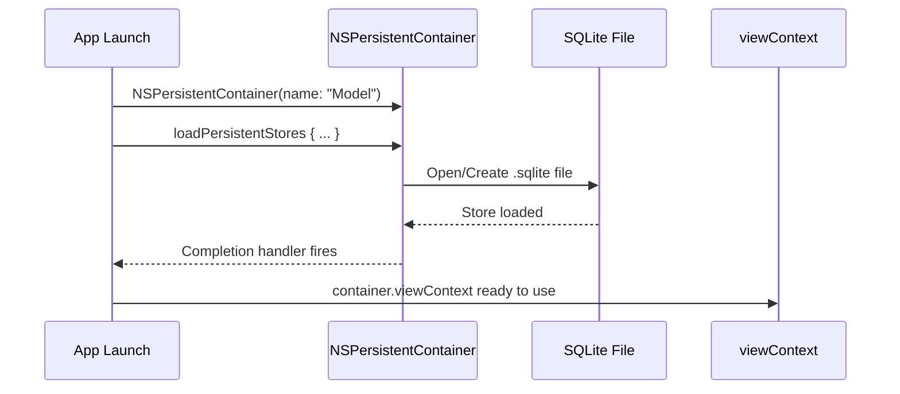
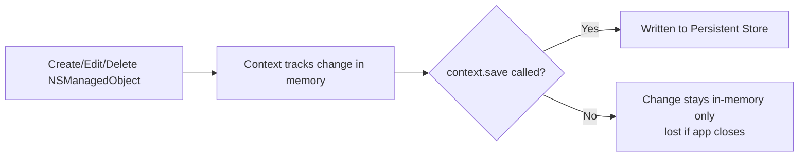
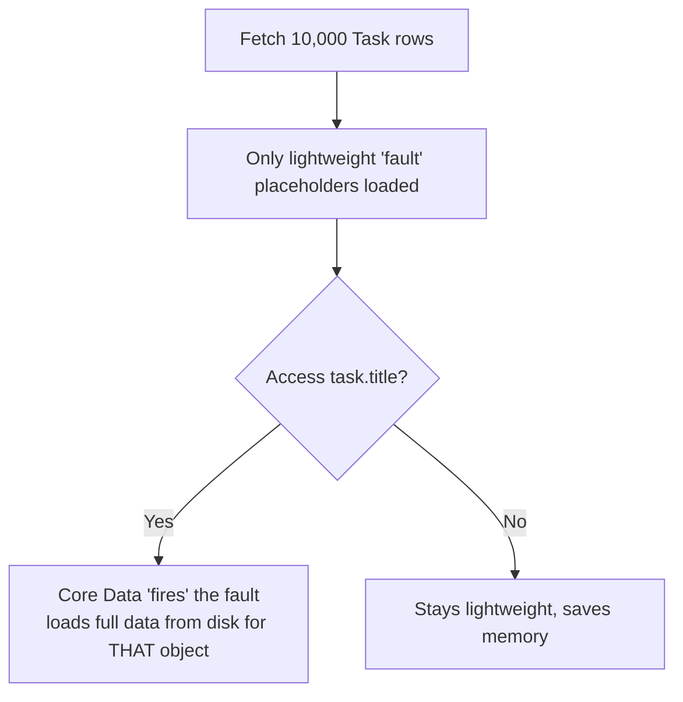
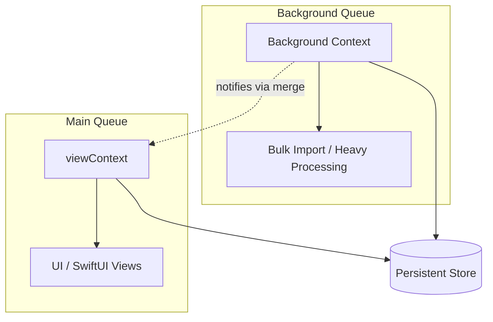
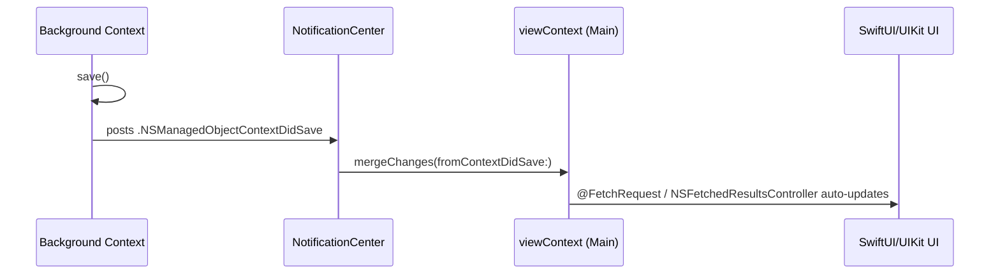
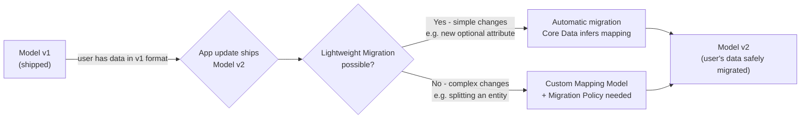
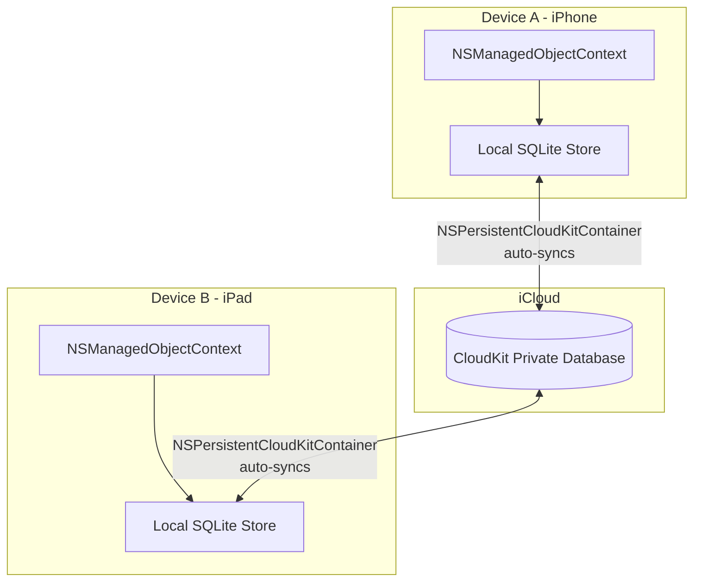

# Core Data — The Complete Developer Guide

A full reference covering Core Data's architecture, data modeling, CRUD operations, concurrency, migrations, and modern integrations (SwiftUI, CloudKit) — with diagrams and real code examples.

---

## Table of Contents
1. [What Core Data Is](#1-what-core-data-is)
2. [Core Data Architecture](#2-core-data-architecture)
3. [Data Model — Entities, Attributes & Relationships](#3-data-model--entities-attributes--relationships)
4. [Delete Rules](#4-delete-rules)
5. [Code Generation](#5-code-generation)
6. [NSManagedObject, Persistent Container & Core Data Stack](#6-nsmanagedobject-persistent-container--core-data-stack)
7. [Managed Object Context](#7-managed-object-context)
8. [CRUD: Creating, Saving, Reading, Updating, Deleting](#8-crud-operations)
9. [Predicates](#9-predicates)
10. [Sorting, Pagination & Fetch Optimization](#10-sorting-pagination--fetch-optimization)
11. [Object IDs, Faulting & Uniquing](#11-object-ids-faulting--uniquing)
12. [Validation, Unique Constraints & Merge Policies](#12-validation-unique-constraints--merge-policies)
13. [Concurrency](#13-concurrency)
14. [Background Import](#14-background-import)
15. [Merging Changes Between Contexts](#15-merging-changes-between-contexts)
16. [Batch Insert, Update, and Delete](#16-batch-insert-update-and-delete)
17. [Undo, Rollback, Reset & Refresh](#17-undo-rollback-reset--refresh)
18. [SwiftUI Integration](#18-swiftui-integration)
19. [UIKit & NSFetchedResultsController](#19-uikit--nsfetchedresultscontroller)
20. [Model Versioning & Migration](#20-model-versioning--migration)
21. [Persistent History Tracking](#21-persistent-history-tracking)
22. [Core Data with CloudKit](#22-core-data-with-cloudkit)

---

## 1. What Core Data Is

Core Data is Apple's **object graph management and persistence framework** for iOS, macOS, watchOS, and tvOS. It is *not* a database itself — it's a layer that sits on top of a storage engine (usually SQLite) and lets you work with your data as native Swift/Objective-C objects instead of writing raw SQL.

**In one sentence:** Core Data turns rows in a database into objects you can create, fetch, edit, and delete like any other Swift object — then it takes care of saving those changes back to disk.

### What it gives you for free
- Automatic disk persistence (SQLite, binary, or in-memory store)
- Change tracking (undo/redo built in)
- Lazy loading of data (faulting) so large datasets don't blow up memory
- Relationship management (one-to-many, many-to-many) with integrity rules
- Data validation
- Migration tooling as your schema evolves
- Sync support via CloudKit

### What Core Data is NOT
- It is not an ORM in the strict sense (it manages an *object graph*, not just table mappings)
- It is not a networking layer — it stores data locally; syncing is a separate concern (handled via CloudKit integration)
- It is not required for simple flat data — `UserDefaults` or `Codable` + JSON may be simpler for small settings-like data

---

## 2. Core Data Architecture

Core Data is composed of a stack of cooperating objects. Here's how they relate:



**How the pieces cooperate:**

| Layer | Role | Analogy |
|---|---|---|
| `NSManagedObjectModel` | Describes entities, attributes, relationships (your `.xcdatamodeld` file compiled) | The blueprint of a building |
| `NSPersistentStoreCoordinator` | Sits between the context and the store; routes requests | The building's front desk |
| `NSPersistentStore` | The actual file on disk (SQLite by default) | The physical building |
| `NSManagedObjectContext` | An in-memory "scratchpad" where you create/edit objects before saving | Your desk in the building |
| `NSManagedObject` | A single instance of an entity (e.g., one `Task`) | A single document on your desk |
| `NSPersistentContainer` | Bundles model + coordinator + store + default context setup | The whole office building, pre-furnished |

### Setting up the stack (modern approach)

```swift
let container = NSPersistentContainer(name: "MyAppModel")
container.loadPersistentStores { storeDescription, error in
    if let error = error {
        fatalError("Unresolved error \(error)")
    }
}
let context = container.viewContext
```

---

## 3. Data Model — Entities, Attributes & Relationships

The **data model** (`.xcdatamodeld` file) is where you visually define your schema.

- **Entity** → like a database table or a class (e.g., `Task`, `Author`, `Book`)
- **Attribute** → a property/column on that entity (e.g., `title: String`, `dueDate: Date`)
- **Relationship** → a connection between two entities (e.g., `Author` has-many `Books`)

### Example: A Blog App Model



- `Author` → `Book` is **one-to-many** (an author writes many books)
- `Book` → `Tag` is **many-to-many** (a book can have many tags, a tag can apply to many books)

### Attribute types available
`String`, `Integer 16/32/64`, `Decimal`, `Double`, `Float`, `Boolean`, `Date`, `Binary Data`, `UUID`, `URI`, `Transformable` (for custom Codable objects).

### Defining a relationship in code (after modeling in the editor)

```swift
// Auto-generated from the model, but conceptually:
class Author: NSManagedObject {
    @NSManaged var name: String
    @NSManaged var books: NSSet? // to-many relationship
}

class Book: NSManagedObject {
    @NSManaged var title: String
    @NSManaged var author: Author? // to-one inverse relationship
}
```

> **Real project use case:** In a **Notes app**, `Folder` (one) → `Note` (many) lets you delete a folder and decide what happens to its notes — which leads directly into delete rules.

---

## 4. Delete Rules

When you delete an object, Core Data needs to know what to do with related objects. You configure this **per relationship** in the model editor.

| Delete Rule | Behavior | Example |
|---|---|---|
| **Cascade** | Deleting the object also deletes related objects | Delete a `Folder` → all its `Notes` are deleted too |
| **Nullify** | The relationship is set to `nil`/removed, related object survives | Delete an `Author` → their `Books` remain, but `book.author = nil` |
| **Deny** | Prevents deletion if related objects still exist | Can't delete a `Category` while `Products` still reference it |
| **No Action** | Does nothing automatically — you must manage integrity manually (rarely used, risk of dangling references) | Manual cleanup required |



**Real use case:** E-commerce app — deleting a `Category` should use **Deny** (protect data integrity) while deleting a `User` should **Cascade** to their `CartItems` (no orphaned cart data).

---

## 5. Code Generation

In the model editor, each entity has a **Codegen** setting:

| Option | What happens | When to use |
|---|---|---|
| **Class Definition** (default) | Xcode auto-generates the full `NSManagedObject` subclass at build time — invisible in your project navigator | Simple entities, no custom logic |
| **Category/Extension** | Xcode generates only the properties; you manually create the class file for custom methods | You need computed properties or custom logic on the entity |
| **Manual/None** | You write the entire `NSManagedObject` subclass yourself | Full control, custom initializers, complex business logic |

### Example: Adding a computed property (using Category/Extension)

```swift
// Xcode generates Task+CoreDataProperties.swift automatically
// You manually create Task+CoreDataClass.swift:
extension Task {
    var isOverdue: Bool {
        guard let due = dueDate else { return false }
        return due < Date() && !isDone
    }
}
```

---

## 6. NSManagedObject, Persistent Container & Core Data Stack

- **`NSManagedObject`** is the base class every entity's generated class inherits from. It behaves like a dictionary with typed accessors, and is *tracked* by whichever context created it.
- **`NSPersistentContainer`** is the modern (iOS 10+) convenience API that sets up the entire stack — model, coordinator, store, and a default `viewContext` — in a few lines.



```swift
class PersistenceController {
    static let shared = PersistenceController()
    let container: NSPersistentContainer

    init() {
        container = NSPersistentContainer(name: "MyAppModel")
        container.loadPersistentStores { _, error in
            if let error = error { fatalError("\(error)") }
        }
        container.viewContext.automaticallyMergesChangesFromParent = true
    }
}
```

---

## 7. Managed Object Context

The **`NSManagedObjectContext`** is your scratchpad. Nothing you do (create, edit, delete) is permanent until you call `save()`.

- `viewContext` → runs on the **main thread**, meant for UI-bound work
- Custom background contexts → for heavy work (imports, bulk edits) off the main thread

```swift
let context = container.viewContext          // main-thread scratchpad
let bgContext = container.newBackgroundContext() // background scratchpad
```

Think of each context as its **own private draft** of the data — changes in one aren't visible to another until saved and merged.

---

## 8. CRUD Operations

### Creating Objects
```swift
let task = Task(context: context)
task.title = "Buy groceries"
task.dueDate = Date()
task.isDone = false
```

### Saving Changes
```swift
if context.hasChanges {
    do {
        try context.save()
    } catch {
        print("Save failed: \(error)")
    }
}
```

### Reading and Fetching Data
```swift
let request: NSFetchRequest<Task> = Task.fetchRequest()
let allTasks = try? context.fetch(request)
```

### Updating Objects
```swift
if let taskToUpdate = allTasks?.first {
    taskToUpdate.isDone = true
    try? context.save() // Core Data tracks the change automatically
}
```

### Deleting Objects
```swift
if let taskToDelete = allTasks?.first {
    context.delete(taskToDelete)
    try? context.save()
}
```



---

## 9. Predicates

`NSPredicate` is how you **filter** fetch requests — like a `WHERE` clause in SQL.

```swift
// Simple equality
request.predicate = NSPredicate(format: "isDone == %@", NSNumber(value: false))

// String search (case-insensitive)
request.predicate = NSPredicate(format: "title CONTAINS[cd] %@", "grocery")

// Date range
request.predicate = NSPredicate(format: "dueDate >= %@ AND dueDate <= %@", startDate, endDate)

// Compound predicates
let notDone = NSPredicate(format: "isDone == NO")
let highPriority = NSPredicate(format: "priority == %@", "high")
request.predicate = NSCompoundPredicate(andPredicateWithSubpredicates: [notDone, highPriority])
```

**Real use case:** A **task manager app** filters "show me all high-priority tasks due this week that aren't done yet" — all in one predicate, evaluated efficiently at the database level (not in Swift after fetching everything).

---

## 10. Sorting, Pagination & Fetch Optimization

```swift
// Sorting
request.sortDescriptors = [
    NSSortDescriptor(key: "dueDate", ascending: true),
    NSSortDescriptor(key: "title", ascending: true) // secondary sort
]

// Pagination (e.g., infinite scroll)
request.fetchLimit = 20
request.fetchOffset = 40 // skip first 40 (page 3 of 20-per-page)

// Optimization: only fetch what you need
request.propertiesToFetch = ["title", "dueDate"] // skip loading large fields
request.returnsObjectsAsFaults = false // avoid re-fetching immediately after
```

**Real use case:** A **social feed app** loads 20 posts at a time as the user scrolls (`fetchLimit`/`fetchOffset`), rather than pulling thousands of rows into memory at once.

---

## 11. Object IDs, Faulting & Uniquing

### NSManagedObjectID
Every managed object has a unique `objectID` — a safe way to reference an object **across contexts and threads** (never pass the object itself across threads).

```swift
let objectID = task.objectID
// On another context/thread:
let sameTask = try? backgroundContext.existingObject(with: objectID) as? Task
```

### Faulting
Core Data doesn't load full object data into memory until you actually access it — this is a **fault**. It keeps memory usage low even with huge datasets.



### Uniquing
Within a single context, Core Data guarantees only **one object instance** exists per `objectID` — fetching the same row twice returns the *same* Swift object reference, not a duplicate.

---

## 12. Validation, Unique Constraints & Merge Policies

### Validation
Set rules directly in the model editor (e.g., string max length, number ranges) or override programmatically:

```swift
override func validateForInsert() throws {
    try super.validateForInsert()
    if title.isEmpty {
        throw NSError(domain: "TaskValidation", code: 1,
                       userInfo: [NSLocalizedDescriptionKey: "Title cannot be empty"])
    }
}
```

### Unique Constraints
In the model editor, mark attributes (e.g., `email` on a `User` entity) as a **Constraint** — Core Data then enforces uniqueness at the SQLite level and merges duplicates on save according to your merge policy.

### Merge Policies
Define what happens when the same object is edited in two places at once:

| Policy | Behavior |
|---|---|
| `NSErrorMergePolicy` (default) | Throws an error on conflict — you must resolve manually |
| `NSMergeByPropertyObjectTrumpMergePolicy` | In-memory (unsaved) changes win, per property |
| `NSMergeByPropertyStoreTrumpMergePolicy` | Disk (already-saved) values win, per property |
| `NSOverwriteMergePolicy` | In-memory object completely overwrites store |
| `NSRollbackMergePolicy` | Disk version completely wins, discarding in-memory edits |

```swift
context.mergePolicy = NSMergeByPropertyObjectTrumpMergePolicy
```

**Real use case:** A **collaborative notes app** where the same note might be edited on two devices — a merge policy decides whose edit "wins" when syncing.

---

## 13. Concurrency

**Golden rule:** Never pass an `NSManagedObject` between threads. Always confine a context (and its objects) to one queue, and pass `NSManagedObjectID` across threads instead.



```swift
// Correct: use perform/performAndWait to hop onto the context's own queue
context.perform {
    let task = Task(context: context)
    task.title = "Created safely on context's queue"
    try? context.save()
}

// For synchronous work:
context.performAndWait {
    // safe, blocking access to this context's queue
}
```

---

## 14. Background Import

For heavy operations (e.g., importing 5,000 records from an API), use a background context so the UI never freezes.

```swift
container.performBackgroundTask { bgContext in
    for item in downloadedItems {
        let task = Task(context: bgContext)
        task.title = item.title
        task.dueDate = item.dueDate
    }
    do {
        try bgContext.save()
    } catch {
        print("Background save failed: \(error)")
    }
}
```

**Real use case:** A **news reader app** syncing hundreds of articles from an API every launch — done on a background context so scrolling stays smooth.

---

## 15. Merging Changes Between Contexts

When a background context saves, the main `viewContext` needs to know about those changes.

```swift
// Easiest: automatic merging
container.viewContext.automaticallyMergesChangesFromParent = true

// Manual approach (older pattern):
NotificationCenter.default.addObserver(
    forName: .NSManagedObjectContextDidSave,
    object: bgContext, queue: .main
) { notification in
    viewContext.mergeChanges(fromContextDidSave: notification)
}
```



---

## 16. Batch Insert, Update, and Delete

For very large operations, bypass loading objects into memory entirely — operate directly at the SQLite level.

```swift
// Batch Insert (iOS 13+)
let insertRequest = NSBatchInsertRequest(entity: Task.entity(), objects: [
    ["title": "Task 1", "isDone": false],
    ["title": "Task 2", "isDone": false]
])
try context.execute(insertRequest)

// Batch Update
let updateRequest = NSBatchUpdateRequest(entityName: "Task")
updateRequest.predicate = NSPredicate(format: "isDone == NO")
updateRequest.propertiesToUpdate = ["isDone": true]
updateRequest.resultType = .updatedObjectIDsResultType
let result = try context.execute(updateRequest) as? NSBatchUpdateResult

// Batch Delete
let fetchForDelete: NSFetchRequest<NSFetchRequestResult> = Task.fetchRequest()
fetchForDelete.predicate = NSPredicate(format: "isDone == YES")
let deleteRequest = NSBatchDeleteRequest(fetchRequest: fetchForDelete)
deleteRequest.resultType = .resultTypeObjectIDs
let deleteResult = try context.execute(deleteRequest) as? NSBatchDeleteResult

// IMPORTANT: batch operations bypass the context, so merge manually
if let objectIDs = deleteResult?.result as? [NSManagedObjectID] {
    NSManagedObjectContext.mergeChanges(
        fromRemoteContextSave: [NSDeletedObjectsKey: objectIDs],
        into: [context]
    )
}
```

**Real use case:** "Mark all notifications as read" or "clear all completed tasks" in a to-do app — done instantly on millions of rows without loading a single object into RAM.

---

## 17. Undo, Rollback, Reset & Refresh

```swift
// Undo (requires an UndoManager attached to the context)
context.undoManager = UndoManager()
context.undo()   // reverts last change
context.redo()   // re-applies it

// Rollback: discard ALL unsaved changes in this context
context.rollback()

// Reset: wipes the context clean, including cached objects (heavier than rollback)
context.reset()

// Refresh: re-fetches a specific object's data, discarding local unsaved edits to it
context.refresh(task, mergeChanges: false)
```

**Real use case:** A **drawing/notes app** with an "Undo" button in the toolbar — wired directly to `context.undo()`.

---

## 18. SwiftUI Integration

Core Data integrates natively with SwiftUI via `@FetchRequest` and the environment's `managedObjectContext`.

```swift
struct TaskListView: View {
    @Environment(\.managedObjectContext) private var context

    @FetchRequest(
        sortDescriptors: [SortDescriptor(\.dueDate, order: .forward)],
        predicate: NSPredicate(format: "isDone == NO")
    ) var tasks: FetchedResults<Task>

    var body: some View {
        List {
            ForEach(tasks) { task in
                Text(task.title ?? "Untitled")
            }
            .onDelete(perform: deleteTasks)
        }
    }

    private func deleteTasks(at offsets: IndexSet) {
        offsets.map { tasks[$0] }.forEach(context.delete)
        try? context.save()
    }
}

// App entry point wiring:
@main
struct MyApp: App {
    let persistenceController = PersistenceController.shared
    var body: some Scene {
        WindowGroup {
            TaskListView()
                .environment(\.managedObjectContext, persistenceController.container.viewContext)
        }
    }
}
```

`@FetchRequest` **automatically re-renders the view** whenever the underlying data changes — no manual notification handling needed.

---

## 19. UIKit & NSFetchedResultsController

In UIKit, `NSFetchedResultsController` (NSFRC) is the equivalent of SwiftUI's `@FetchRequest` — it watches a fetch request and tells your table/collection view exactly what changed.

```swift
let fetchedResultsController: NSFetchedResultsController<Task> = {
    let request: NSFetchRequest<Task> = Task.fetchRequest()
    request.sortDescriptors = [NSSortDescriptor(key: "dueDate", ascending: true)]
    let frc = NSFetchedResultsController(
        fetchRequest: request,
        managedObjectContext: context,
        sectionNameKeyPath: nil,
        cacheName: nil
    )
    frc.delegate = self
    return frc
}()

func viewDidLoad() {
    super.viewDidLoad()
    try? fetchedResultsController.performFetch()
}

// Delegate methods automatically drive tableView.insertRows/deleteRows/reloadRows
extension MyViewController: NSFetchedResultsControllerDelegate {
    func controller(_ controller: NSFetchedResultsController<NSFetchRequestResult>,
                     didChange anObject: Any, at indexPath: IndexPath?,
                     for type: NSFetchedResultsChangeType, newIndexPath: IndexPath?) {
        // handle .insert, .delete, .update, .move
    }
}
```

**Real use case:** A **Mail-like inbox** where new messages animate into the table view in real time as they arrive, without manually calling `reloadData()`.

---

## 20. Model Versioning & Migration

As your app evolves, your data model changes — but existing users already have data in the old format on disk. **Migration** moves their data forward safely.



### Lightweight migration (most common case)
```swift
let description = NSPersistentStoreDescription()
description.shouldMigrateStoreAutomatically = true
description.shouldInferMappingModelAutomatically = true
container.persistentStoreDescriptions = [description]
```

### Heavyweight migration (structural changes)
Requires a **Mapping Model** (`.xcmappingmodel`) created in Xcode that explicitly maps old entities/attributes to new ones, sometimes with a custom `NSEntityMigrationPolicy` subclass for complex transformations.

**Real use case:** A **fitness app** that originally stored `weight` as a single `Double` decides to split it into `weightValue` + `weightUnit` (kg/lbs) in v2 — this structural change needs a custom mapping model.

---

## 21. Persistent History Tracking

Persistent History Tracking (iOS 11+) lets Core Data record a durable, queryable **transaction log** of every insert/update/delete — essential for:
- Multi-process apps (e.g., an app + its Share Extension both writing to the same store)
- CloudKit sync (knows exactly what changed since last sync)
- Building custom sync/notification systems

```swift
let description = container.persistentStoreDescriptions.first
description?.setOption(true as NSNumber, forKey: NSPersistentHistoryTrackingKey)
description?.setOption(true as NSNumber, forKey: NSPersistentStoreRemoteChangeNotificationPostOptionKey)

// Querying history since a token:
let historyRequest = NSPersistentHistoryChangeRequest.fetchHistory(after: lastToken)
let result = try context.execute(historyRequest) as? NSPersistentHistoryResult
```

**Real use case:** A **widget + main app combo** — the iOS Home Screen widget and the main app both read/write the same Core Data store; persistent history tracking tells each process exactly what the other changed.

---

## 22. Core Data with CloudKit

`NSPersistentCloudKitContainer` (iOS 13+) syncs your Core Data store across a user's devices via iCloud — automatically.



```swift
let container = NSPersistentCloudKitContainer(name: "MyAppModel")
container.loadPersistentStores { _, error in
    if let error = error { fatalError("\(error)") }
}
container.viewContext.automaticallyMergesChangesFromParent = true
container.viewContext.mergePolicy = NSMergeByPropertyObjectTrumpMergePolicy
```

### Requirements for CloudKit-compatible models
- Every attribute must have a **default value** (no required-without-default fields)
- All relationships must be **optional**
- Every entity needs a unique constraint or CloudKit assigns record names automatically
- No "Deny" delete rules (not supported with CloudKit sync)

**Real use case:** A **habit tracker app** where a user logs a habit on their iPhone during a commute, then opens their iPad at home and instantly sees it — zero custom networking code written by the developer.

---

## Quick Reference: Which Feature Solves Which Problem?

| Problem | Core Data Feature |
|---|---|
| "I need my app's data to survive a restart" | Basic Core Data stack + `save()` |
| "I need to filter/search records" | `NSPredicate` |
| "Loading everything freezes my app" | Faulting + `fetchLimit`/`fetchOffset` |
| "Heavy import is blocking the UI" | Background context + `performBackgroundTask` |
| "My table view should auto-update" | `NSFetchedResultsController` / `@FetchRequest` |
| "Two devices edited the same record" | Merge Policies |
| "I changed my schema after shipping" | Lightweight/Heavyweight Migration |
| "I need multi-process data sharing" | Persistent History Tracking |
| "I want free multi-device sync" | `NSPersistentCloudKitContainer` |
| "I need to update/delete millions of rows fast" | Batch Insert/Update/Delete |

---

*This guide covers Core Data as of iOS 17/Xcode 15. For brand-new, Swift-only projects on iOS 17+, also consider **SwiftData** — Apple's newer macro-based wrapper built on the same underlying engine, offering less boilerplate for common cases while Core Data remains the better choice for complex migrations, CloudKit customization, and legacy codebases.*
