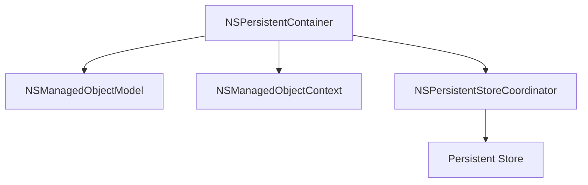
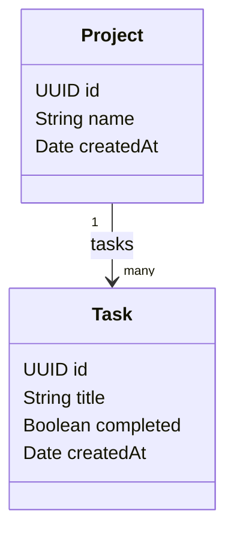
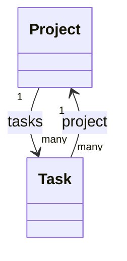
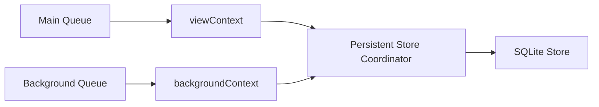
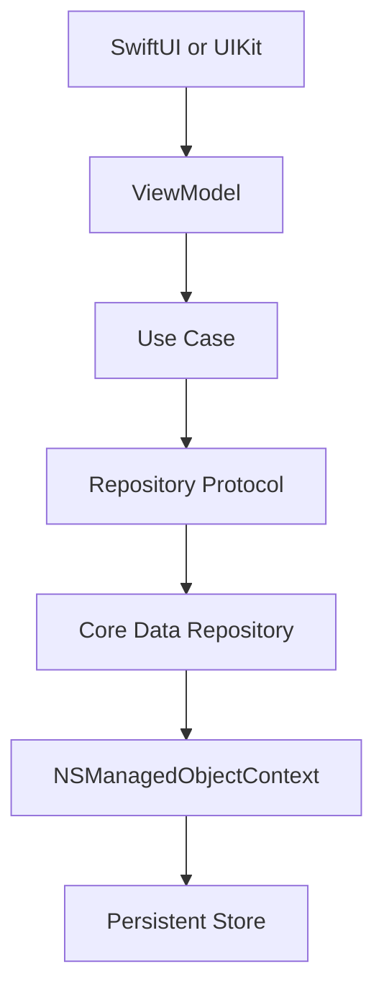
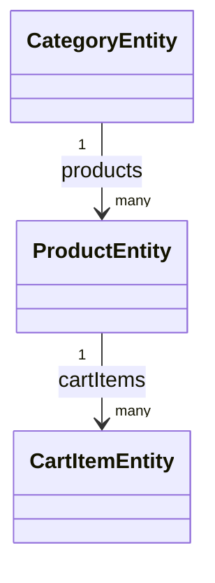

# Core Data in Swift & iOS — Complete Practical Guide

> A repository-friendly Core Data reference for experienced iOS developers.  
> Covers setup, the Core Data stack, modeling, CRUD, fetching, relationships, concurrency, performance, migrations, SwiftUI/UIKit integration, CloudKit, testing, debugging, and production architecture.

---

## Table of Contents

1. [What Core Data Is](#1-what-core-data-is)
2. [When to Use Core Data](#2-when-to-use-core-data)
3. [Core Data vs SQLite vs SwiftData](#3-core-data-vs-sqlite-vs-swiftdata)
4. [Core Data Architecture](#4-core-data-architecture)
5. [Setting Up Core Data in Xcode](#5-setting-up-core-data-in-xcode)
6. [The Data Model](#6-the-data-model)
7. [Entities](#7-entities)
8. [Attributes](#8-attributes)
9. [Relationships](#9-relationships)
10. [Delete Rules](#10-delete-rules)
11. [Code Generation and NSManagedObject](#11-code-generation-and-nsmanagedobject)
12. [Persistent Container and Core Data Stack](#12-persistent-container-and-core-data-stack)
13. [Managed Object Context](#13-managed-object-context)
14. [Creating Objects](#14-creating-objects)
15. [Saving Changes](#15-saving-changes)
16. [Reading and Fetching Data](#16-reading-and-fetching-data)
17. [Predicates](#17-predicates)
18. [Sorting](#18-sorting)
19. [Pagination and Fetch Optimization](#19-pagination-and-fetch-optimization)
20. [Updating Objects](#20-updating-objects)
21. [Deleting Objects](#21-deleting-objects)
22. [Object IDs](#22-object-ids)
23. [Faulting and Uniquing](#23-faulting-and-uniquing)
24. [Validation](#24-validation)
25. [Unique Constraints and Merge Policies](#25-unique-constraints-and-merge-policies)
26. [Concurrency](#26-concurrency)
27. [Background Import](#27-background-import)
28. [Merging Changes Between Contexts](#28-merging-changes-between-contexts)
29. [Batch Insert, Update, and Delete](#29-batch-insert-update-and-delete)
30. [Undo, Rollback, Reset, and Refresh](#30-undo-rollback-reset-and-refresh)
31. [SwiftUI Integration](#31-swiftui-integration)
32. [UIKit and NSFetchedResultsController](#32-uikit-and-nsfetchedresultscontroller)
33. [Model Versioning and Migration](#33-model-versioning-and-migration)
34. [Persistent History Tracking](#34-persistent-history-tracking)
35. [Core Data with CloudKit](#35-core-data-with-cloudkit)
36. [Testing Core Data](#36-testing-core-data)
37. [Performance Guidelines](#37-performance-guidelines)
38. [Debugging Core Data](#38-debugging-core-data)
39. [Production Architecture](#39-production-architecture)
40. [Real Project Example](#40-real-project-example)
41. [Common Mistakes](#41-common-mistakes)
42. [Senior Interview Topics](#42-senior-interview-topics)
43. [Core Data Cheatsheet](#43-core-data-cheatsheet)
44. [Official References](#44-official-references)

---

# 1. What Core Data Is

Core Data is Apple's framework for managing an application's **object graph and persistence layer**. It tracks changes to model objects, manages relationships, performs queries, supports undo/redo, and can persist objects into stores such as SQLite.

Core Data should not be thought of as a thin SQLite wrapper. Your application works with managed objects and contexts, while Core Data decides how those objects are materialized, tracked, cached, and persisted.

```text
Application
    │
    ▼
Managed Objects
    │
    ▼
Managed Object Context
    │
    ▼
Core Data
    │
    ▼
Persistent Store
```

Typical use cases include:

- Offline application data
- Local caching of server responses
- Complex object relationships
- Large searchable datasets
- Background imports
- Undo/redo workflows
- CloudKit-backed synchronization

---

# 2. When to Use Core Data

Core Data is a strong choice when your app contains structured data with relationships and needs local persistence, change tracking, efficient fetching, or background processing. It becomes especially useful when a simple file or `UserDefaults` is no longer sufficient.

It may be excessive for very small preferences or a handful of primitive values. For settings such as theme choice, feature toggles, or the last selected tab, `UserDefaults` is usually simpler.

### Good candidates

```text
E-commerce cache
Expense tracker
Offline-first enterprise app
Messaging cache
Document metadata
Medical records app
Inventory system
Large task manager
```

### Usually not good candidates

```text
Theme preference
Boolean settings
Small configuration values
Secure credentials
```

Use Keychain for secrets such as authentication tokens rather than treating Core Data as secure credential storage.

---

# 3. Core Data vs SQLite vs SwiftData

Core Data is an **object graph management framework** that can use SQLite as one of its persistent-store implementations. SQLite is a relational database engine where you directly design tables and issue SQL, while Core Data operates at a higher abstraction level.

SwiftData provides a newer Swift-native persistence API and is built around concepts familiar to Core Data. Core Data remains highly relevant in mature production codebases, UIKit applications, older OS deployment targets, complex migration scenarios, and applications already deeply integrated with `NSManagedObjectContext`.

| Technology | Best mental model |
|---|---|
| Core Data | Object graph + persistence framework |
| SQLite | Relational database engine |
| SwiftData | Modern Swift-native persistence framework |
| UserDefaults | Small preferences |
| Keychain | Sensitive credentials |
| Files / Codable | Document-style or simple serialized data |

---

# 4. Core Data Architecture

The major Core Data stack objects work together rather than independently. `NSPersistentContainer` is the modern convenience API that creates and owns the model, persistent-store coordinator, and common contexts.



### `NSManagedObjectModel`

Represents the application's model definition, normally loaded from an `.xcdatamodeld` file. It describes entities, attributes, relationships, constraints, and other model metadata.

### `NSManagedObjectContext`

Represents a working area or scratchpad for managed objects. It tracks inserted, modified, and deleted objects until you save or discard those changes.

### `NSPersistentStoreCoordinator`

Coordinates access between one or more managed object contexts and the underlying persistent stores. Modern apps usually let `NSPersistentContainer` configure it rather than building it manually.

### `NSPersistentStore`

Represents the physical backing store. SQLite is the common persistent format, while in-memory stores are particularly useful for testing.

---

# 5. Setting Up Core Data in Xcode

You can add Core Data while creating a new application or add a model to an existing project later. Depending on the Xcode project template, the option may appear as **Use Core Data** or as a **Storage** choice.

For an existing project, add a new **Data Model** file from Xcode's file templates. Xcode creates an `.xcdatamodeld` package where you define entities, attributes, and relationships.

## 5.1 Setup steps

### New application

1. Create a new iOS application in Xcode.
2. Choose Swift as the language.
3. Enable Core Data / choose Core Data as the storage option when available.
4. Xcode adds the model and persistence setup.

### Existing application

1. Choose **File → New → File**.
2. Select the iOS platform.
3. Find the **Core Data** section.
4. Choose **Data Model**.
5. Name the model, for example `AppDataModel`.
6. Add the model to the application target.

> **Current Apple setup reference:**  
> https://developer.apple.com/documentation/coredata/creating-a-core-data-model

---

## 5.2 Xcode Data Model Editor — visual reference

The following Apple documentation image shows the Core Data model editor with entities, attributes, relationships, the editor area, and the Data Model inspector.


> The screenshot comes from Apple's archived Core Data documentation, so the exact Xcode UI may look different in a current Xcode release. The concepts and editor areas remain useful for understanding the model.

Source:  
https://developer.apple.com/library/archive/documentation/Cocoa/Conceptual/CoreData/KeyConcepts.html

---

# 6. The Data Model

The `.xcdatamodeld` file describes the **schema of your object graph**. It is conceptually similar to database schema design, but you model objects and relationships rather than directly creating SQL tables.

A well-designed Core Data model should reflect domain concepts rather than UI screens. If your application has `Project`, `Task`, `User`, and `Attachment` concepts, those are better entity candidates than names such as `TaskScreenData`.

Example model:



---

# 7. Entities

An entity describes a type of object Core Data manages. An entity normally maps to an `NSManagedObject` subclass at runtime and contains attributes, relationships, constraints, and configuration metadata.

Think of an entity as the Core Data equivalent of a domain type definition rather than simply a database table. Core Data may choose a storage representation different from the class structure you see in Swift.

Example entities:

```text
Project
Task
User
Attachment
Category
Order
Product
```

### Useful entity settings

- Name
- Class
- Module
- Codegen
- Parent Entity
- Abstract
- Constraints

### Abstract entities

An abstract entity is used as a parent for shared properties but is never instantiated directly. This can reduce model duplication, although entity inheritance should be used carefully with SQLite-backed stores because inheritance can affect storage layout and performance.

---

# 8. Attributes

Attributes are the scalar or value properties stored for an entity. Examples include a task's title, creation date, identifier, priority, and completion state.

Core Data supports common types such as String, Boolean, Date, Decimal, Integer, Double, Binary Data, UUID, URI, and Transformable values. Prefer native supported types when possible because they are easier to query and migrate.

Example `Task` attributes:

| Attribute | Type | Optional | Example |
|---|---|---:|---|
| `id` | UUID | No | UUID() |
| `title` | String | No | "Learn Core Data" |
| `createdAt` | Date | No | Date() |
| `completed` | Boolean | No | false |
| `priority` | Integer 16 | No | 1 |

## 8.1 Attribute inspector — visual reference


The inspector allows you to configure properties such as optionality, type, default values, indexing, and versioning information. The exact UI changes between Xcode releases, but the underlying concepts are the same.

---

## 8.2 Optional attributes

An optional attribute may contain `nil`, whereas a required attribute must contain a valid value before the object can be successfully saved. Avoid making everything optional merely to simplify generated Swift types.

Good models express domain requirements. If every task must have an identifier and creation date, those attributes should generally be required with values assigned at creation time.

---

## 8.3 Transient attributes

Transient attributes belong to the managed object model but are not persisted in the store. Core Data can still track them as part of the object lifecycle and undo system.

They can be useful for temporary calculated state that logically belongs to the model but should not be stored. Do not use transient attributes as a general substitute for normal computed Swift properties.

---

## 8.4 Derived attributes

Derived attributes let Core Data maintain a value based on another modeled value or relationship. They are useful when a calculated value needs to be maintained efficiently at the persistence layer rather than recalculated repeatedly in application code.

Use them only when the derived value genuinely improves the model or performance. A simple Swift computed property is often easier when the calculation is inexpensive.

---

## 8.5 Transformable attributes

Transformable attributes allow Core Data to persist values that do not map naturally to standard attribute types. They are convenient, but they make querying individual fields inside the transformed value difficult.

Prefer explicit entities or supported scalar attributes for important domain data. Use transformables for self-contained value objects that do not need independent querying.

---

# 9. Relationships

Relationships connect entities and allow Core Data to maintain an object graph. A relationship may be to-one, to-many, or many-to-many depending on the domain.

Core Data relationships should almost always have an inverse relationship. Inverses allow Core Data to maintain graph consistency and understand how changes on one side affect the other.

## Example

```text
Project
   │
   └── tasks → Task

Task
   │
   └── project → Project
```



## Relationship inspector — visual reference


Relationship settings include:

- Destination entity
- Inverse relationship
- To-one / to-many cardinality
- Optionality
- Delete rule
- Minimum / maximum count where applicable

---

# 10. Delete Rules

Delete rules define what should happen to related objects when an object is deleted. Choosing the correct rule is important because a mistake can either leave unwanted objects behind or delete far more data than intended.

Core Data supports four commonly discussed delete rules.

## Nullify

The related object remains, but the relationship is cleared.

```text
Delete Project
     │
     ▼
Task remains
task.project = nil
```

Use it when the child can validly exist without the parent.

## Cascade

Deleting the parent also deletes the related objects.

```text
Delete Order
    │
    └── Delete OrderItems
```

Use it when child objects have no independent lifecycle outside the parent.

## Deny

The deletion is rejected if related objects still exist. It is useful when the application must remove or reassign children before deleting the parent.

Example: prevent deleting a category while products still belong to it.

## No Action

Core Data does not automatically update the related objects. This rule requires you to manage consistency yourself and is therefore less common in typical application models.

---

# 11. Code Generation and NSManagedObject

`NSManagedObject` is the base class for Core Data-managed model objects. Xcode can generate subclasses automatically or you can create the subclasses manually.

The **Codegen** option on an entity controls how Swift classes are created.

## Common Codegen modes

### Class Definition

Xcode automatically generates the managed object subclass and properties behind the scenes. This is convenient and works well when you do not need to edit the generated properties directly.

### Category/Extension

Xcode generates property accessors while you provide the main class. This can be useful when you want a manually maintained class with generated modeled properties.

### Manual/None

You create the `NSManagedObject` subclass and `@NSManaged` properties yourself. This gives maximum visibility and control but requires generated files to remain synchronized with the model.

Example manual subclass:

```swift
import CoreData

@objc(TaskEntity)
final class TaskEntity: NSManagedObject {
    @NSManaged var id: UUID
    @NSManaged var title: String
    @NSManaged var createdAt: Date
    @NSManaged var completed: Bool
    @NSManaged var project: ProjectEntity?
}
```

---

# 12. Persistent Container and Core Data Stack

`NSPersistentContainer` is the standard entry point for constructing a modern Core Data stack. It loads the model, creates the persistent-store coordinator, and exposes contexts including the main-queue `viewContext`.

Encapsulating the container in a persistence controller keeps Core Data setup in one location and makes testing easier.

```swift
import CoreData

final class PersistenceController {

    static let shared = PersistenceController()

    let container: NSPersistentContainer

    init(inMemory: Bool = false) {
        container = NSPersistentContainer(name: "AppDataModel")

        if inMemory {
            let description = NSPersistentStoreDescription()
            description.type = NSInMemoryStoreType
            container.persistentStoreDescriptions = [description]
        }

        container.loadPersistentStores { description, error in
            if let error {
                fatalError(
                    "Unable to load store: \(error.localizedDescription)"
                )
            }

            print("Loaded store:", description)
        }

        container.viewContext.automaticallyMergesChangesFromParent = true
    }
}
```

### Important

The string passed to:

```swift
NSPersistentContainer(name: "AppDataModel")
```

must correspond to the Core Data model name.

---

# 13. Managed Object Context

`NSManagedObjectContext` is an in-memory workspace that tracks object changes. Creating or modifying an `NSManagedObject` changes the context first; the persistent store is not updated until the context is saved.

A context also provides identity management, change tracking, validation, undo support, and a controlled concurrency queue.

```text
Persistent Store
      ▲
      │ save
      │
Managed Object Context
      ▲
      │ changes
      │
Managed Objects
```

### Main context

```swift
let context = container.viewContext
```

The `viewContext` is associated with the main queue and is appropriate for data directly driving the UI.

### Background context

```swift
let backgroundContext = container.newBackgroundContext()
```

A background context uses a private queue and is appropriate for imports, large processing operations, and work that should not block the user interface.

---

# 14. Creating Objects

A managed object must belong to a context. When using generated subclasses, the context-aware initializer is the most common way to create a new object.

```swift
let context = PersistenceController.shared.container.viewContext

let task = TaskEntity(context: context)
task.id = UUID()
task.title = "Learn Core Data"
task.createdAt = Date()
task.completed = false
```

At this point, the object exists in the context but has not necessarily reached the persistent store.

```text
Insert
  │
  ▼
Context
  │
save()
  ▼
Persistent Store
```

---

# 15. Saving Changes

Calling `save()` commits pending context changes toward the context's parent or persistent store. Always handle errors because validation, migration, constraint conflicts, disk problems, or model mismatches can make a save fail.

A convenience method avoids unnecessary saves when the context has no changes.

```swift
extension NSManagedObjectContext {

    func saveIfNeeded() throws {
        guard hasChanges else { return }
        try save()
    }
}
```

Usage:

```swift
do {
    try context.saveIfNeeded()
} catch {
    print("Save failed:", error)
}
```

### Important parent-context behavior

If a context has a parent context, saving the child pushes changes **into the parent**, not necessarily all the way to disk. The parent still needs to save before those changes reach the persistent store.

---

# 16. Reading and Fetching Data

`NSFetchRequest` describes what Core Data should retrieve. A fetch can specify an entity, predicate, sorting, limits, batching behavior, and result type.

Fetching is not the same as reading a SQL table. Core Data executes the request against the stores and materializes managed objects into the requesting context.

```swift
let request: NSFetchRequest<TaskEntity> = TaskEntity.fetchRequest()

do {
    let tasks = try context.fetch(request)
    print(tasks)
} catch {
    print("Fetch failed:", error)
}
```

---

# 17. Predicates

A predicate filters which objects are returned by a fetch request. It is Core Data's equivalent of expressing query conditions such as completed tasks, a specific project, or records created after a date.

Predicates should use modeled property names and values that can be translated by the persistent store.

```swift
let request: NSFetchRequest<TaskEntity> = TaskEntity.fetchRequest()

request.predicate = NSPredicate(
    format: "completed == %@",
    NSNumber(value: false)
)
```

Examples:

```swift
request.predicate = NSPredicate(
    format: "title CONTAINS[cd] %@",
    "swift"
)
```

```swift
request.predicate = NSPredicate(
    format: "createdAt >= %@",
    startDate as NSDate
)
```

Multiple conditions:

```swift
let incomplete = NSPredicate(
    format: "completed == NO"
)

let priority = NSPredicate(
    format: "priority >= %d",
    2
)

request.predicate = NSCompoundPredicate(
    andPredicateWithSubpredicates: [
        incomplete,
        priority
    ]
)
```

---

# 18. Sorting

Sort descriptors define the order of fetched objects. If multiple descriptors are supplied, they are applied in array order.

Sorting at fetch time is usually preferable to fetching everything and sorting large result sets afterward in memory.

```swift
request.sortDescriptors = [
    NSSortDescriptor(
        keyPath: \TaskEntity.createdAt,
        ascending: false
    )
]
```

Multiple sorting levels:

```swift
request.sortDescriptors = [
    NSSortDescriptor(
        keyPath: \TaskEntity.completed,
        ascending: true
    ),
    NSSortDescriptor(
        keyPath: \TaskEntity.createdAt,
        ascending: false
    )
]
```

---

# 19. Pagination and Fetch Optimization

Large datasets should not always be materialized in memory at once. `fetchLimit`, `fetchOffset`, and `fetchBatchSize` allow you to constrain or incrementally materialize results.

`fetchBatchSize` is particularly useful for list-style UI because Core Data can fetch result identities while realizing managed objects in smaller batches as needed.

```swift
request.fetchLimit = 50
request.fetchOffset = 0
request.fetchBatchSize = 50
```

Next page:

```swift
request.fetchOffset = 50
```

### Important

Offset-based pagination can become expensive for very large data sets. When possible, consider keyset-style predicates such as fetching records after the last known timestamp or identifier.

---

# 20. Updating Objects

Managed objects are updated by modifying their properties inside the correct context. Core Data tracks those changes automatically and marks the context as having unsaved changes.

You normally fetch the object, change the required values, then save the context.

```swift
task.title = "Master Core Data"
task.completed = true

do {
    try context.save()
} catch {
    print(error)
}
```

Check changed values:

```swift
if context.hasChanges {
    try? context.save()
}
```

---

# 21. Deleting Objects

Deleting a managed object marks it for deletion in its context. The persistent-store record is removed when the context is saved.

Relationship delete rules are evaluated as part of this process, so deleting one object can affect related objects.

```swift
context.delete(task)

do {
    try context.save()
} catch {
    print("Delete failed:", error)
}
```

SwiftUI list deletion commonly maps offsets to fetched objects:

```swift
func deleteTasks(
    offsets: IndexSet,
    tasks: FetchedResults<TaskEntity>,
    context: NSManagedObjectContext
) {
    offsets.map { tasks[$0] }
        .forEach(context.delete)

    try? context.save()
}
```

---

# 22. Object IDs

Every managed object has an `NSManagedObjectID`. The object ID is the correct way to refer to a managed object across contexts or concurrency queues.

Do not pass a managed object itself from a main-queue context to a background context. Pass its `objectID`, then ask the destination context to resolve that ID.

```swift
let objectID = task.objectID

backgroundContext.perform {
    do {
        let taskInBackground =
            try backgroundContext.existingObject(with: objectID)

        print(taskInBackground)
    } catch {
        print(error)
    }
}
```

### Temporary vs permanent IDs

New unsaved managed objects may initially have temporary object IDs. Saving the context or requesting permanent IDs gives them persistent identities.

```swift
try context.obtainPermanentIDs(for: [task])
```

---

# 23. Faulting and Uniquing

A fault is a lightweight placeholder for a managed object whose property data has not yet been fully loaded. Faulting allows Core Data to represent large object graphs without loading every property and related object into memory.

When code accesses a property that requires data, Core Data may automatically fire the fault and retrieve the required information.

```text
Managed Object Fault
       │
access property
       ▼
Persistent Store
       │
       ▼
Realized Object
```

### Uniquing

Within a given managed object context, Core Data ensures that one persistent record is represented by one managed object instance. This helps maintain object identity and consistent relationships.

### Check whether an object is a fault

```swift
print(task.isFault)
```

Be cautious when logging complete managed objects because a `description` implementation or relationship access may accidentally fire many faults.

---

# 24. Validation

Core Data can validate modeled requirements when a context is saved. Required attributes, relationship rules, custom validation, and uniqueness constraints can all cause a save to fail.

Validation belongs close to the data model when it expresses data integrity, but business rules that depend on remote state or application workflow often belong in domain/use-case logic.

Custom validation example:

```swift
extension TaskEntity {

    @objc
    func validateTitle(
        _ value: AutoreleasingUnsafeMutablePointer<AnyObject?>
    ) throws {

        guard let title = value.pointee as? String,
              !title.trimmingCharacters(
                in: .whitespacesAndNewlines
              ).isEmpty
        else {
            throw NSError(
                domain: "TaskValidation",
                code: 1,
                userInfo: [
                    NSLocalizedDescriptionKey:
                        "Title cannot be empty."
                ]
            )
        }
    }
}
```

In production code, prefer typed domain errors and carefully test custom Core Data validation behavior.

---

# 25. Unique Constraints and Merge Policies

Unique constraints prevent duplicate records based on one or more attributes. They are particularly useful for server-backed data where a remote identifier should correspond to only one local record.

A common model constraint is:

```text
TaskEntity
Constraint: remoteID
```

When two changes conflict, the context's merge policy determines how Core Data resolves the conflict.

```swift
context.mergePolicy =
    NSMergeByPropertyObjectTrumpMergePolicy
```

Common policies include:

| Policy | Meaning |
|---|---|
| `NSErrorMergePolicy` | Report conflict as an error |
| Object trump | In-memory object values win |
| Store trump | Persistent-store values win |
| Overwrite | Object snapshot replaces store values |
| Rollback | Conflicting object changes are rolled back |

Choose a policy based on business semantics rather than convenience.

---

# 26. Concurrency

A managed object context is tied to its configured concurrency queue. The `viewContext` is main-queue based, while `newBackgroundContext()` and `performBackgroundTask` create private-queue contexts.

Never use a context or its managed objects arbitrarily from another queue. Use `perform` / `performAndWait`, and use `NSManagedObjectID` when data must cross context boundaries.



Background context:

```swift
let background = container.newBackgroundContext()

background.perform {
    // Use background and its objects only here.
}
```

Modern container-based background task:

```swift
container.performBackgroundTask { context in
    // Perform import or processing.
}
```

---

# 27. Background Import

Large JSON imports should normally happen away from the main queue. A background context can parse or insert data and save without blocking scrolling or interaction.

When the background context saves, the view context can merge those changes so the user interface observes the updated data.

```swift
container.performBackgroundTask { context in

    for dto in remoteTasks {
        let task = TaskEntity(context: context)
        task.id = dto.id
        task.title = dto.title
        task.createdAt = dto.createdAt
    }

    do {
        try context.save()
    } catch {
        print("Import failed:", error)
    }
}
```

Configure the view context:

```swift
container.viewContext.automaticallyMergesChangesFromParent = true
```

For very large imports, consider `NSBatchInsertRequest`.

---

# 28. Merging Changes Between Contexts

Multiple contexts can hold different in-memory snapshots of the same store. A save from a background context does not magically rewrite already-registered objects in another context unless changes are merged.

`automaticallyMergesChangesFromParent` is a convenient option for view contexts that should observe saves made through the same persistent container.

```swift
container.viewContext.automaticallyMergesChangesFromParent = true
```

You can also merge changes explicitly when working with lower-level notifications or batch operations.

```swift
NSManagedObjectContext.mergeChanges(
    fromRemoteContextSave: changes,
    into: [container.viewContext]
)
```

---

# 29. Batch Insert, Update, and Delete

Batch operations work directly at the persistent-store level and avoid materializing every affected object into memory. They are designed for large data operations where normal object-by-object processing would be expensive.

Because these operations bypass normal context object tracking, in-memory contexts may need to merge the affected object IDs or refresh their state afterward.

## 29.1 Batch insert

```swift
let objects: [[String: Any]] = remoteTasks.map {
    [
        "id": $0.id,
        "title": $0.title,
        "createdAt": $0.createdAt,
        "completed": $0.completed
    ]
}

let request = NSBatchInsertRequest(
    entityName: "TaskEntity",
    objects: objects
)

try backgroundContext.execute(request)
```

## 29.2 Batch update

```swift
let request =
    NSBatchUpdateRequest(entityName: "TaskEntity")

request.predicate = NSPredicate(
    format: "completed == NO"
)

request.propertiesToUpdate = [
    "completed": true
]

request.resultType = .updatedObjectIDsResultType

let result =
    try context.execute(request) as? NSBatchUpdateResult
```

## 29.3 Batch delete

```swift
let fetch: NSFetchRequest<NSFetchRequestResult> =
    TaskEntity.fetchRequest()

fetch.predicate = NSPredicate(
    format: "createdAt < %@",
    cutoffDate as NSDate
)

let request = NSBatchDeleteRequest(
    fetchRequest: fetch
)

request.resultType = .resultTypeObjectIDs

let result =
    try context.execute(request) as? NSBatchDeleteResult
```

Merge deleted IDs:

```swift
if let ids = result?.result as? [NSManagedObjectID] {

    NSManagedObjectContext.mergeChanges(
        fromRemoteContextSave: [
            NSDeletedObjectsKey: ids
        ],
        into: [
            PersistenceController.shared
                .container
                .viewContext
        ]
    )
}
```

---

# 30. Undo, Rollback, Reset, and Refresh

A managed object context can support undo operations through an `UndoManager`. This is useful for editors, document workflows, and transactional UI where users expect reversible changes.

Rollback and reset have broader effects than a normal property edit, so use them intentionally.

## Undo manager

```swift
context.undoManager = UndoManager()

context.undo()
context.redo()
```

## Rollback

```swift
context.rollback()
```

`rollback()` discards unsaved insertions and deletions and restores updated objects to their last committed values.

## Reset

```swift
context.reset()
```

`reset()` returns the context to a base state and invalidates its registered managed objects. Existing references to those managed objects should no longer be used.

---

# 31. SwiftUI Integration

SwiftUI can receive a managed object context through the environment and query Core Data using `@FetchRequest`. Changes to the fetched results are reflected in the view as the underlying context changes.

This approach is convenient for view-owned queries, but larger applications often keep business logic outside the view and expose dedicated repository or feature APIs.

## 31.1 Inject the context

```swift
@main
struct CoreDataDemoApp: App {

    let persistence =
        PersistenceController.shared

    var body: some Scene {
        WindowGroup {
            TaskListView()
                .environment(
                    \.managedObjectContext,
                    persistence.container.viewContext
                )
        }
    }
}
```

## 31.2 Fetch objects

```swift
struct TaskListView: View {

    @Environment(\.managedObjectContext)
    private var context

    @FetchRequest(
        sortDescriptors: [
            SortDescriptor(
                \TaskEntity.createdAt,
                order: .reverse
            )
        ]
    )
    private var tasks:
        FetchedResults<TaskEntity>

    var body: some View {
        List(tasks) { task in
            Text(task.title)
        }
    }
}
```

## 31.3 Add an object

```swift
private func addTask() {

    let task = TaskEntity(context: context)
    task.id = UUID()
    task.title = "New Task"
    task.createdAt = Date()
    task.completed = false

    try? context.save()
}
```

---

## 31.4 Dynamic fetch requests

When a predicate depends on view input, create the `FetchRequest` in the view initializer or move fetching into a repository/service layer.

Example:

```swift
struct FilteredTaskList: View {

    @FetchRequest
    private var tasks:
        FetchedResults<TaskEntity>

    init(showCompleted: Bool) {

        let predicate = NSPredicate(
            format: "completed == %@",
            NSNumber(value: showCompleted)
        )

        _tasks = FetchRequest(
            sortDescriptors: [
                SortDescriptor(
                    \TaskEntity.createdAt,
                    order: .reverse
                )
            ],
            predicate: predicate
        )
    }

    var body: some View {
        List(tasks) { task in
            Text(task.title)
        }
    }
}
```

---

# 32. UIKit and NSFetchedResultsController

`NSFetchedResultsController` is designed to manage Core Data fetch results used in table or collection-oriented interfaces. It monitors context changes and can tell a delegate which sections and objects were inserted, deleted, moved, or updated.

It remains highly relevant in UIKit applications and large mature codebases where precise incremental UI updates are needed.

```swift
let request: NSFetchRequest<TaskEntity> =
    TaskEntity.fetchRequest()

request.sortDescriptors = [
    NSSortDescriptor(
        keyPath: \TaskEntity.createdAt,
        ascending: false
    )
]

let controller =
    NSFetchedResultsController(
        fetchRequest: request,
        managedObjectContext: context,
        sectionNameKeyPath: nil,
        cacheName: nil
    )

controller.delegate = self

try controller.performFetch()
```

A fetched-results controller requires an ordered fetch request, so provide at least one sort descriptor.

---

# 33. Model Versioning and Migration

A production application's data model evolves over time. If you ship a schema change without correctly migrating existing user stores, loading the persistent store can fail.

Core Data supports model versions and several migration approaches. Always test migration using real stores produced by previous released versions.

```text
Model v1
   │
   ▼
Model v2
   │
Migration
   ▼
Existing Store Updated
```

## 33.1 Add a model version

In Xcode:

1. Select the `.xcdatamodeld`.
2. Choose **Editor → Add Model Version**.
3. Name the new version.
4. Make the new version current.
5. Apply schema changes to the new version.

Never casually edit an already-shipped model version as though old user stores did not exist.

---

## 33.2 Lightweight migration

Lightweight migration works when Core Data can infer how the old schema maps to the new schema.

Typical inferable changes include:

- Adding an entity
- Adding an optional attribute
- Removing some properties
- Making a required attribute optional
- Compatible renames when configured correctly

`NSPersistentContainer` generally handles common migration configuration automatically when model versions are bundled correctly.

---

## 33.3 Renaming properties

When renaming an attribute or entity, configure its **Renaming Identifier** to the previous name. This gives Core Data the information required to infer that the new property corresponds to an existing stored property.

Without this mapping information, a rename can be interpreted as "delete old property + create unrelated new property."

---

## 33.4 Staged migration

Staged migrations support complex transitions that cannot be expressed as one lightweight migration. Instead of jumping directly from a very old schema to the newest schema, the application moves through controlled stages.

This is useful for long-lived applications where production users may upgrade from several model versions behind.

---

## 33.5 Manual / heavyweight migration

Manual migration is necessary when the transformation cannot be inferred or expressed by simpler migration tools. Examples include splitting one entity into multiple entities or performing complex data transformations.

A manual migration uses mapping information and migration policies to explicitly transform source objects into destination objects.

---

# 34. Persistent History Tracking

Persistent history stores transactions describing changes made to the persistent store. It allows a process or context to ask, "What changed since the last history token I processed?"

This is useful for multi-context applications, app extensions, CloudKit synchronization workflows, and cases where store-level changes need to be consumed reliably.

Conceptually:

```text
Save 1 ─┐
Save 2 ─┼── Persistent History
Save 3 ─┘
             │
             ▼
        History Token
             │
             ▼
       Process changes
```

Relevant types include:

- `NSPersistentHistoryToken`
- `NSPersistentHistoryChangeRequest`
- `NSPersistentHistoryTransaction`
- `NSPersistentHistoryChange`

---

# 35. Core Data with CloudKit

`NSPersistentCloudKitContainer` integrates Core Data persistence with CloudKit synchronization. The local Core Data store remains the application's object-store interface while CloudKit mirrors supported data across devices.

This is not the same as manually writing CloudKit record synchronization code. The container coordinates much of the mapping and change propagation, but your Core Data model must be compatible with CloudKit requirements.

```swift
let container =
    NSPersistentCloudKitContainer(
        name: "AppDataModel"
    )

container.loadPersistentStores {
    description,
    error in

    if let error {
        fatalError(error.localizedDescription)
    }
}
```

Typical setup also requires:

- iCloud capability
- CloudKit capability
- Correct container entitlements
- CloudKit-compatible Core Data model
- Production schema deployment

Official reference:  
https://developer.apple.com/documentation/coredata/setting-up-core-data-with-cloudkit

---

# 36. Testing Core Data

Tests should not depend on a developer's real application store. An in-memory persistent store gives each test an isolated environment with the same managed object model and Core Data behavior.

Keep the persistence layer injectable so test code can create a fresh container for every test suite or test method.

```swift
final class TestPersistenceController {

    let container: NSPersistentContainer

    init() {
        container =
            NSPersistentContainer(
                name: "AppDataModel"
            )

        let description =
            NSPersistentStoreDescription()

        description.type =
            NSInMemoryStoreType

        container.persistentStoreDescriptions = [
            description
        ]

        container.loadPersistentStores {
            _, error in

            precondition(
                error == nil,
                "Unable to create test store"
            )
        }
    }
}
```

Example test:

```swift
func testInsertTask() throws {

    let persistence =
        TestPersistenceController()

    let context =
        persistence.container.viewContext

    let task =
        TaskEntity(context: context)

    task.id = UUID()
    task.title = "Test"
    task.createdAt = Date()

    try context.save()

    let request:
        NSFetchRequest<TaskEntity> =
            TaskEntity.fetchRequest()

    let results =
        try context.fetch(request)

    XCTAssertEqual(results.count, 1)
}
```

---

## 36.1 Migration testing

For a production application, keep fixture stores created by old released versions and verify that the current application can open and migrate them.

A successful unit test created from only the newest model does not prove that an existing customer's multi-year store can migrate safely.

---

# 37. Performance Guidelines

Core Data is highly optimized, but inefficient object-graph access can still produce slow applications. Most performance problems come from fetching too much, blocking the main queue, firing many faults accidentally, or repeatedly saving tiny changes.

Measure before optimizing, and understand whether the bottleneck is fetch execution, object materialization, relationship traversal, saving, migration, or UI work.

## 37.1 Use fetch batch sizes

```swift
request.fetchBatchSize = 50
```

This helps large list views avoid materializing all managed objects at once.

## 37.2 Use fetch limits

```swift
request.fetchLimit = 100
```

Do not fetch 100,000 objects if a screen can display only the first page.

## 37.3 Push filtering into the fetch

Prefer:

```swift
request.predicate =
    NSPredicate(format: "completed == NO")
```

over fetching all objects and then:

```swift
allTasks.filter { !$0.completed }
```

for large persistent datasets.

## 37.4 Avoid expensive work on `viewContext`

Imports, mass transformations, and batch processing should usually execute in a background context.

## 37.5 Avoid accidental N+1 relationship loading

Repeatedly traversing relationships in a loop may fire many faults. Consider prefetching important relationships when appropriate.

```swift
request.relationshipKeyPathsForPrefetching = [
    "project"
]
```

Prefetch only relationships the operation genuinely needs because prefetching everything can increase memory use.

## 37.6 Use result types appropriate to the query

If you only need counts, dictionaries, or aggregate values, avoid materializing full managed objects unnecessarily.

```swift
let count = try context.count(for: request)
```

---

# 38. Debugging Core Data

Core Data errors often become easier to diagnose when you inspect the complete `NSError`, the persistent-store URL, model versions, and concurrency behavior rather than only printing `localizedDescription`.

During development, launch arguments can expose SQL and concurrency behavior.

## SQL logging

Add a scheme launch argument:

```text
-com.apple.CoreData.SQLDebug 1
```

Higher levels may emit more detail, but logging can be extremely verbose.

## Concurrency debugging

Development builds can use:

```text
-com.apple.CoreData.ConcurrencyDebug 1
```

This helps detect invalid queue usage of managed object contexts and managed objects.

## Print detailed save errors

```swift
do {
    try context.save()
} catch let error as NSError {
    print("Core Data error:")
    print("Domain:", error.domain)
    print("Code:", error.code)
    print("UserInfo:", error.userInfo)
}
```

---

## 38.1 Common store-loading failure

```text
The model used to open the store
is incompatible with the one used
to create the store.
```

Typical causes include:

- Editing a shipped model instead of creating a new version
- Incorrect current model version
- Missing bundled model
- Unsupported migration
- Wrong container/model name

Deleting the app fixes the problem only for development. It is not a migration strategy for production users.

---

# 39. Production Architecture

Avoid spreading Core Data API calls throughout every View and ViewModel. A persistence/repository layer can hide storage-specific behavior and make application logic easier to test.

One practical architecture is:



### Domain model vs managed object

For small apps, directly exposing `NSManagedObject` to the UI can be perfectly reasonable. For larger systems, SDKs, modular apps, or long-lived enterprise products, mapping managed objects to domain models can reduce persistence coupling.

Example:

```swift
struct Task: Identifiable, Equatable {
    let id: UUID
    let title: String
    let completed: Bool
}
```

Mapping:

```swift
extension TaskEntity {

    func toDomain() -> Task {
        Task(
            id: id,
            title: title,
            completed: completed
        )
    }
}
```

---

## 39.1 Repository protocol

```swift
protocol TaskRepository {

    func fetchTasks() throws -> [Task]

    func createTask(
        title: String
    ) throws

    func setCompleted(
        id: UUID,
        completed: Bool
    ) throws

    func deleteTask(
        id: UUID
    ) throws
}
```

The application layer now depends on a capability rather than directly depending on Core Data.

---

# 40. Real Project Example

Consider an enterprise e-commerce/mobile application that supports offline browsing. The backend remains the source of truth, while Core Data provides a local cache of products, categories, favorites, cart metadata, and pending synchronization state.

A practical flow looks like:


## Example entities

```text
ProductEntity
- id
- name
- price
- updatedAt
- imageURL
- isFavorite

CategoryEntity
- id
- name

CartItemEntity
- id
- quantity
- updatedAt
```

Relationships:



---

## 40.1 Sync process

1. Fetch remote DTOs.
2. Import them using a background context.
3. Upsert records using unique server IDs.
4. Save the background context.
5. Merge changes into `viewContext`.
6. SwiftUI / fetched-results controllers update automatically.

```text
Server
  │
  ▼
JSON DTO
  │
  ▼
Background Context
  │
  ▼
Core Data Store
  │
  ▼
View Context
  │
  ▼
UI
```

---

## 40.2 Upsert example

```swift
func upsert(
    _ dto: ProductDTO,
    context: NSManagedObjectContext
) throws {

    let request:
        NSFetchRequest<ProductEntity> =
            ProductEntity.fetchRequest()

    request.fetchLimit = 1

    request.predicate = NSPredicate(
        format: "id == %@",
        dto.id as CVarArg
    )

    let product =
        try context.fetch(request).first
        ?? ProductEntity(context: context)

    product.id = dto.id
    product.name = dto.name
    product.price = dto.price
    product.updatedAt = dto.updatedAt
}
```

For large remote feeds, unique constraints plus batch insertion or a carefully designed import pipeline may provide better performance.

---

# 41. Common Mistakes

## Mistake 1 — Treating Core Data as direct SQL

The SQLite database is an implementation detail. Do not open the store yourself and modify Core Data tables with arbitrary SQL.

## Mistake 2 — Using `viewContext` for large imports

Heavy imports can freeze scrolling and interaction. Move processing to a background context or batch request.

## Mistake 3 — Passing managed objects across queues

Managed objects belong to a context and its queue. Pass `NSManagedObjectID` instead.

## Mistake 4 — Missing inverse relationships

Inverse relationships are important for object-graph consistency. Configure them deliberately rather than treating them as optional decoration.

## Mistake 5 — Making every attribute optional

This weakens your data model and makes business invariants harder to enforce. Model required values as required.

## Mistake 6 — Using cascade without understanding ownership

A cascade rule can recursively delete large parts of an object graph. Use it only when related objects truly belong to the deleted parent.

## Mistake 7 — Editing a released model version

Always create a new model version for shipped schema evolution.

## Mistake 8 — Ignoring save errors

A failed save is not a minor logging issue. Inspect and handle the underlying error.

## Mistake 9 — Fetching everything

Use predicates, limits, batching, and appropriate result types.

## Mistake 10 — Assuming a background save instantly updates all contexts

Merge changes explicitly or configure automatic merging where appropriate.

---

# 42. Senior Interview Topics

A senior iOS engineer should be able to explain not only Core Data APIs but also **why the architecture behaves the way it does**.

Be prepared to discuss:

- Why Core Data is not simply a database wrapper
- `NSPersistentContainer`
- `NSManagedObjectModel`
- `NSManagedObjectContext`
- `NSPersistentStoreCoordinator`
- Managed object lifecycle
- Faulting
- Uniquing
- Context concurrency
- `NSManagedObjectID`
- Background imports
- Merge policies
- Unique constraints
- Batch operations
- Delete rules
- `NSFetchedResultsController`
- SwiftUI `@FetchRequest`
- Model versioning
- Lightweight migration
- Staged migration
- Manual migration
- Persistent history
- CloudKit integration
- Repository abstraction
- Performance tuning

---

## Interview question: Why can't I pass an NSManagedObject to another queue?

A managed object is associated with the managed object context that created or fetched it, and that context has a specific concurrency queue. Accessing the object from another queue violates Core Data's concurrency rules.

Pass its `NSManagedObjectID` and refetch or resolve the object in the destination context.

---

## Interview question: What is faulting?

Faulting allows Core Data to keep a lightweight placeholder for an object rather than loading all of its stored property values immediately. Accessing a property can cause the fault to fire and load its data.

This reduces memory use when working with large object graphs.

---

## Interview question: What is the difference between context save and store persistence?

A context save commits its changes to its parent context or persistent-store coordinator, depending on the context hierarchy. A child context save therefore does not necessarily mean data has reached disk.

The complete context chain must eventually be saved.

---

## Interview question: Batch delete vs normal delete?

Normal deletion materializes managed objects and participates in normal object-context change tracking. `NSBatchDeleteRequest` performs deletion directly in the persistent store and is much more efficient for large operations.

Because batch deletion bypasses normal in-memory tracking, affected object IDs should be merged into active contexts.

---

# 43. Core Data Cheatsheet

## Stack

```text
NSPersistentContainer
    │
    ├── NSManagedObjectModel
    ├── viewContext
    └── NSPersistentStoreCoordinator
              │
              ▼
        Persistent Store
```

## Create

```swift
let task = TaskEntity(context: context)
task.id = UUID()
task.title = "Core Data"
try context.save()
```

## Fetch

```swift
let request: NSFetchRequest<TaskEntity> =
    TaskEntity.fetchRequest()

let tasks = try context.fetch(request)
```

## Filter

```swift
request.predicate =
    NSPredicate(format: "completed == NO")
```

## Sort

```swift
request.sortDescriptors = [
    NSSortDescriptor(
        keyPath: \TaskEntity.createdAt,
        ascending: false
    )
]
```

## Update

```swift
task.completed = true
try context.save()
```

## Delete

```swift
context.delete(task)
try context.save()
```

## Background

```swift
container.performBackgroundTask { context in
    // Work here.
}
```

## Pass across contexts

```text
NSManagedObject ❌

NSManagedObjectID ✅
```

## Merge

```swift
container.viewContext
    .automaticallyMergesChangesFromParent = true
```

## Large operations

```text
NSBatchInsertRequest
NSBatchUpdateRequest
NSBatchDeleteRequest
```

## SwiftUI

```swift
@Environment(\.managedObjectContext)
private var context

@FetchRequest(
    sortDescriptors: [
        SortDescriptor(\TaskEntity.createdAt)
    ]
)
private var tasks:
    FetchedResults<TaskEntity>
```

## Migration

```text
Shipped model
    │
    ▼
Create new model version
    │
    ▼
Make version current
    │
    ▼
Lightweight / Staged / Manual migration
```

---

# Core Data Decision Guide

```text
Need small preferences?
        │
        └── UserDefaults

Need secrets?
        │
        └── Keychain

Need object graph + persistence?
        │
        └── Core Data

Starting modern Swift-only app?
        │
        └── Evaluate SwiftData too

Existing enterprise UIKit/Core Data app?
        │
        └── Core Data remains highly relevant
```

---

# 44. Official References

The guide uses Apple documentation as the primary source for framework behavior and setup guidance.

### Core Data overview

https://developer.apple.com/documentation/coredata

### Creating a Core Data model

https://developer.apple.com/documentation/coredata/creating-a-core-data-model

### Core Data stack

https://developer.apple.com/documentation/coredata/core-data-stack

### Setting up a Core Data stack

https://developer.apple.com/documentation/coredata/setting-up-a-core-data-stack

### Modeling data

https://developer.apple.com/documentation/coredata/modeling-data

### Configuring entities

https://developer.apple.com/documentation/coredata/configuring-entities

### Configuring relationships

https://developer.apple.com/documentation/coredata/configuring-relationships

### NSFetchRequest

https://developer.apple.com/documentation/coredata/nsfetchrequest

### Using Core Data in the background

https://developer.apple.com/documentation/coredata/using-core-data-in-the-background

### Batch processing

https://developer.apple.com/documentation/coredata/batch-processing

### Persistent history

https://developer.apple.com/documentation/coredata/persistent-history

### Lightweight migration

https://developer.apple.com/documentation/coredata/migrating-your-data-model-automatically

### Staged migrations

https://developer.apple.com/documentation/coredata/staged-migrations

### Core Data with CloudKit

https://developer.apple.com/documentation/coredata/setting-up-core-data-with-cloudkit

### SwiftUI FetchRequest

https://developer.apple.com/documentation/swiftui/fetchrequest

### NSFetchedResultsController

https://developer.apple.com/documentation/coredata/nsfetchedresultscontroller

### Apple archived model-editor images

https://developer.apple.com/library/archive/documentation/Cocoa/Conceptual/CoreData/KeyConcepts.html

---

# Final Mental Model

```text
Data Model
   │
   ▼
NSPersistentContainer
   │
   ├── View Context ────────────── UI
   │
   ├── Background Context ─────── Imports
   │
   └── Persistent Store Coordinator
                         │
                         ▼
                      SQLite
```

The most important idea is that **the managed object context is the center of day-to-day Core Data work**. You create, fetch, edit, delete, validate, and save managed objects through contexts, while the persistent container and coordinator manage the connection to the store.

For production-quality Core Data code, focus on correct model design, clear context ownership, safe concurrency, controlled migrations, efficient fetches, and a persistence boundary that does not unnecessarily leak storage details through the entire application.
