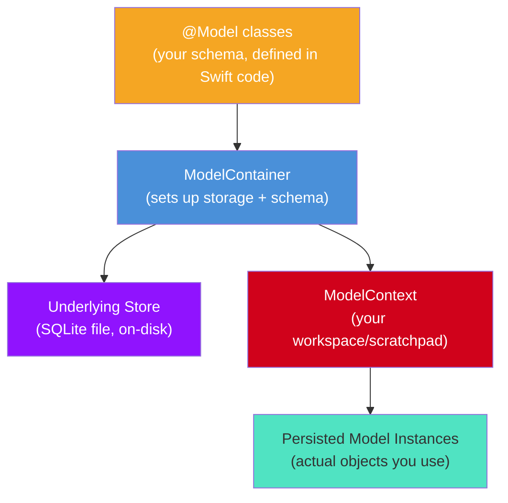
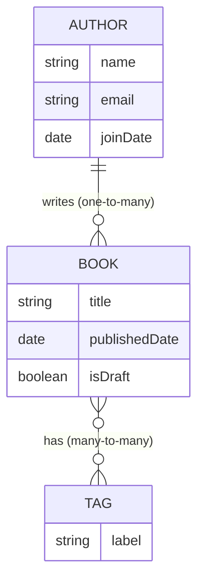
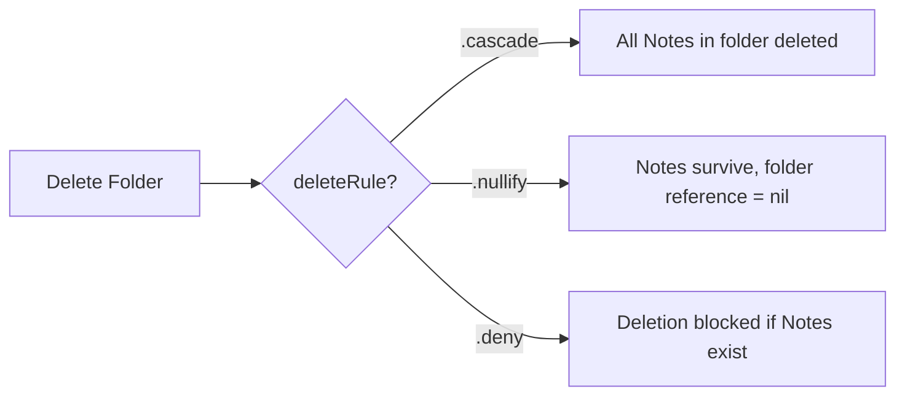
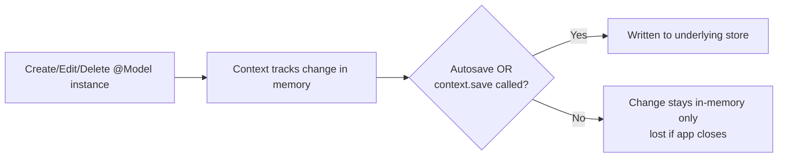
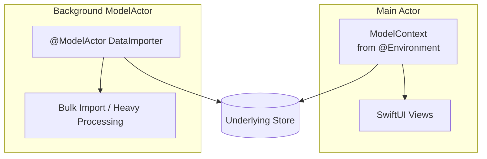
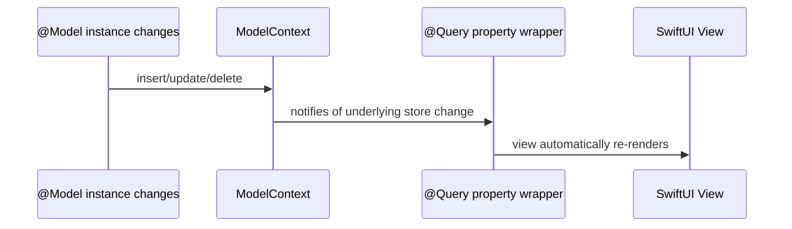
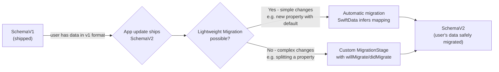
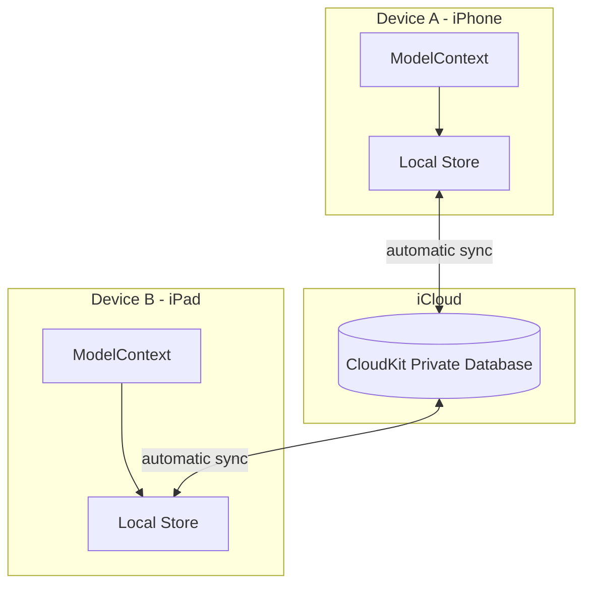

# SwiftData — The Complete Developer Guide (with SwiftUI)

A full reference covering SwiftData's architecture, data modeling, CRUD operations, concurrency, migrations, and SwiftUI integration — with diagrams and real code examples. SwiftData is Apple's modern, Swift-native persistence framework (iOS 17+), built on the same underlying engine philosophy as Core Data but expressed entirely through Swift macros.

---

## Table of Contents
1. [What SwiftData Is](#1-what-swiftdata-is)
2. [SwiftData Architecture](#2-swiftdata-architecture)
3. [Data Model — @Model, Attributes & Relationships](#3-data-model--model-attributes--relationships)
4. [Delete Rules](#4-delete-rules)
5. [PersistentModel & the @Model Macro](#5-persistentmodel--the-model-macro)
6. [ModelContainer](#6-modelcontainer)
7. [ModelContext](#7-modelcontext)
8. [CRUD: Creating, Saving, Reading, Updating, Deleting](#8-crud-operations)
9. [Predicates (#Predicate)](#9-predicates-predicate)
10. [Sorting, Pagination & FetchDescriptor Optimization](#10-sorting-pagination--fetchdescriptor-optimization)
11. [Uniqueness, Identity & Autosave](#11-uniqueness-identity--autosave)
12. [Validation & Default Values](#12-validation--default-values)
13. [Concurrency & ModelActor](#13-concurrency--modelactor)
14. [Background Import](#14-background-import)
15. [Batch Insert & Delete](#15-batch-insert--delete)
16. [Undo Support](#16-undo-support)
17. [SwiftUI Integration — @Query & .modelContainer](#17-swiftui-integration--query--modelcontainer)
18. [Model Versioning & SchemaMigrationPlan](#18-model-versioning--schemamigrationplan)
19. [SwiftData with CloudKit](#19-swiftdata-with-cloudkit)
20. [SwiftData vs Core Data — When to Use Which](#20-swiftdata-vs-core-data--when-to-use-which)

---

## 1. What SwiftData Is

SwiftData (introduced at WWDC 2023, iOS 17+) is Apple's **Swift-native persistence framework**. It lets you turn any Swift class into a persisted, queryable model using a single macro — `@Model` — with no separate schema file, no generated subclasses, and deep, first-class integration with SwiftUI.

**In one sentence:** SwiftData lets you write a plain Swift class, add `@Model`, and instantly get disk persistence, querying, relationships, and automatic SwiftUI view updates — all through Swift syntax instead of a visual editor.

### What it gives you for free
- Persistence with **zero boilerplate** — no `.xcdatamodeld` file, no generated `NSManagedObject` subclasses
- Type-safe queries written as **Swift predicates**, not string-based `NSPredicate` formats
- Automatic SwiftUI updates via `@Query`
- Built on the same battle-tested storage engine lineage as Core Data (and can even coexist with a Core Data stack)
- Native support for `Codable`-friendly value types, enums, and arrays as attributes
- CloudKit sync with a single modifier

### What SwiftData is NOT
- Not a full replacement for Core Data in *every* scenario — some advanced features (derived attributes, complex custom migrations, `NSFetchedResultsController`-level fine control) are still more mature in Core Data
- Not available below iOS 17 / macOS 14 — apps supporting older OS versions still need Core Data
- Not a networking or sync framework by itself (CloudKit integration is opt-in, not automatic)

---

## 2. SwiftData Architecture

SwiftData simplifies the Core Data stack into three main concepts:



| Layer | Role | Core Data equivalent |
|---|---|---|
| `@Model` class | Defines your schema directly in Swift | `NSManagedObjectModel` + generated subclass |
| `ModelContainer` | Sets up the store + schema + default context | `NSPersistentContainer` |
| `ModelContext` | Scratchpad for creating/editing/deleting before saving | `NSManagedObjectContext` |
| Model instance | A single persisted object | `NSManagedObject` |

### Setting up the stack

```swift
import SwiftData

@Model
class Task {
    var title: String
    var dueDate: Date
    var isDone: Bool

    init(title: String, dueDate: Date, isDone: Bool = false) {
        self.title = title
        self.dueDate = dueDate
        self.isDone = isDone
    }
}

// The container is usually created once, at the app's entry point:
let container = try ModelContainer(for: Task.self)
```

---

## 3. Data Model — @Model, Attributes & Relationships

Instead of a visual `.xcdatamodeld` editor, you declare everything as **plain Swift properties** on a class marked `@Model`.

### Example: A Blog App Model



```swift
@Model
class Author {
    var name: String
    var email: String
    var joinDate: Date

    // one-to-many relationship — SwiftData infers the inverse automatically
    @Relationship(deleteRule: .cascade, inverse: \Book.author)
    var books: [Book] = []

    init(name: String, email: String, joinDate: Date = .now) {
        self.name = name
        self.email = email
        self.joinDate = joinDate
    }
}

@Model
class Book {
    var title: String
    var publishedDate: Date
    var isDraft: Bool
    var author: Author?

    // many-to-many relationship
    @Relationship(inverse: \Tag.books)
    var tags: [Tag] = []

    init(title: String, publishedDate: Date, isDraft: Bool = true) {
        self.title = title
        self.publishedDate = publishedDate
        self.isDraft = isDraft
    }
}

@Model
class Tag {
    var label: String
    var books: [Book] = []

    init(label: String) {
        self.label = label
    }
}
```

### Supported attribute types
`String`, `Int`, `Double`, `Bool`, `Date`, `Data`, `UUID`, `URL`, arrays of these, `Codable` enums, and even nested `Codable` structs (stored as encoded blobs automatically).

> **Real project use case:** In a **Notes app**, `Folder` (one) → `Note` (many) is defined with a single `@Relationship` property — no separate schema file to keep in sync with your code.

---

## 4. Delete Rules

Just like Core Data, SwiftData relationships specify what happens to related objects on delete, via the `@Relationship` macro's `deleteRule` parameter.

| Delete Rule | Behavior | Example |
|---|---|---|
| `.cascade` | Deleting the object also deletes related objects | Delete a `Folder` → all its `Notes` are deleted too |
| `.nullify` (default) | Relationship is cleared, related object survives | Delete an `Author` → their `Books` remain, `book.author = nil` |
| `.deny` | Prevents deletion if related objects still exist | Can't delete a `Category` while `Products` reference it |
| `.noAction` | No automatic action taken — manual integrity management | Rarely used |

```swift
@Relationship(deleteRule: .cascade, inverse: \Note.folder)
var notes: [Note] = []
```



**Real use case:** E-commerce app — deleting a `Category` uses `.deny` (protect integrity) while deleting a `User` uses `.cascade` on their `CartItems`.

---

## 5. PersistentModel & the @Model Macro

Every class marked `@Model` automatically conforms to the `PersistentModel` protocol. The macro does the heavy lifting that Core Data's code generation used to do manually:

- Adds persistence-backing storage for every stored property
- Generates a stable `persistentModelID` (SwiftData's equivalent of `NSManagedObjectID`)
- Makes the class `Observable`, so SwiftUI views referencing an instance auto-update when it changes

```swift
@Model
class Task {
    var title: String
    // Computed properties work exactly like normal Swift — no separate extension file needed
    var isOverdue: Bool {
        dueDate < .now && !isDone
    }
    var dueDate: Date
    var isDone: Bool

    init(title: String, dueDate: Date, isDone: Bool = false) {
        self.title = title
        self.dueDate = dueDate
        self.isDone = isDone
    }
}
```

> Unlike Core Data, there's no "Codegen" setting to configure — everything lives in one file, and you can freely mix stored properties, computed properties, and custom methods in the same class declaration.

---

## 6. ModelContainer

The `ModelContainer` is the top-level object that sets up your schema and storage — the SwiftData equivalent of `NSPersistentContainer`.

```swift
// Simple in-app setup
let container = try ModelContainer(for: Task.self, Author.self, Book.self)

// With configuration (e.g., custom URL, in-memory for testing, CloudKit)
let config = ModelConfiguration(
    schema: Schema([Task.self, Author.self, Book.self]),
    isStoredInMemoryOnly: false,
    cloudKitDatabase: .automatic
)
let container = try ModelContainer(for: Task.self, configurations: config)
```

Most commonly, you attach it directly in your SwiftUI `App`:

```swift
@main
struct MyApp: App {
    var body: some Scene {
        WindowGroup {
            ContentView()
        }
        .modelContainer(for: Task.self) // creates & injects the container automatically
    }
}
```

---

## 7. ModelContext

The `ModelContext` is your scratchpad — the SwiftData equivalent of `NSManagedObjectContext`. Every insert, update, and delete happens here before being written to disk.

```swift
// In SwiftUI, grab it from the environment:
@Environment(\.modelContext) private var context

// Manually (e.g., for background work):
let context = ModelContext(container)
```

By default, `ModelContext` has **autosave enabled** — changes are periodically persisted automatically, though you can still call `save()` explicitly for immediate control.

---

## 8. CRUD Operations

### Creating Objects
```swift
let task = Task(title: "Buy groceries", dueDate: .now)
context.insert(task)
```

### Saving Changes
```swift
do {
    try context.save()
} catch {
    print("Save failed: \(error)")
}
```

### Reading and Fetching Data
```swift
let descriptor = FetchDescriptor<Task>()
let allTasks = try? context.fetch(descriptor)
```

### Updating Objects
```swift
if let taskToUpdate = allTasks?.first {
    taskToUpdate.isDone = true
    // No explicit save() needed if autosave is on,
    // but call context.save() for an immediate guarantee
}
```

### Deleting Objects
```swift
if let taskToDelete = allTasks?.first {
    context.delete(taskToDelete)
    try? context.save()
}
```



---

## 9. Predicates (#Predicate)

SwiftData replaces Core Data's string-based `NSPredicate` with the **`#Predicate` macro** — fully type-checked Swift code, with autocomplete and compile-time errors instead of runtime string typos.

```swift
// Simple equality
let notDone = #Predicate<Task> { $0.isDone == false }

// String search
let searchTerm = "grocery"
let containsSearch = #Predicate<Task> { $0.title.contains(searchTerm) }

// Date range
let start = Date.now
let end = Date.now.addingTimeInterval(7 * 24 * 3600)
let dueThisWeek = #Predicate<Task> { $0.dueDate >= start && $0.dueDate <= end }

// Compound predicate — just normal Swift && / ||
let highPriorityNotDone = #Predicate<Task> {
    $0.isDone == false && $0.priority == "high"
}

let descriptor = FetchDescriptor<Task>(predicate: highPriorityNotDone)
let results = try? context.fetch(descriptor)
```

**Real use case:** A **task manager app** filters "show me all high-priority tasks due this week that aren't done yet" — written as ordinary, type-safe Swift with no risk of a malformed format string.

---

## 10. Sorting, Pagination & FetchDescriptor Optimization

```swift
// Sorting
var descriptor = FetchDescriptor<Task>(
    predicate: notDone,
    sortBy: [SortDescriptor(\.dueDate, order: .forward), SortDescriptor(\.title)]
)

// Pagination (e.g., infinite scroll)
descriptor.fetchLimit = 20
descriptor.fetchOffset = 40 // page 3 of 20-per-page

// Optimization: only fetch specific properties (reduces memory)
descriptor.propertiesToFetch = [\.title, \.dueDate]

let page = try? context.fetch(descriptor)
```

**Real use case:** A **social feed app** loads 20 posts at a time as the user scrolls, keeping memory flat even with a huge underlying dataset.

---

## 11. Uniqueness, Identity & Autosave

### Unique Constraints
```swift
@Model
class User {
    @Attribute(.unique) var email: String
    var name: String

    init(email: String, name: String) {
        self.email = email
        self.name = name
    }
}
```
SwiftData enforces uniqueness at the store level — inserting a duplicate `email` updates the existing record (an "upsert") rather than creating a second row.

### Identity — persistentModelID
Every model instance has a `persistentModelID`, the SwiftData equivalent of Core Data's `NSManagedObjectID`, used to reference the same object safely across contexts.

### Autosave
```swift
context.autosaveEnabled = true // default is true
```
With autosave on, SwiftData periodically persists changes (e.g., when the app backgrounds) even if you never call `save()` yourself — useful for simple apps, but explicit saves are still recommended after critical operations.

---

## 12. Validation & Default Values

SwiftData validation happens through **plain Swift initializers and property observers** rather than an overridden method:

```swift
@Model
class Task {
    var title: String {
        didSet {
            if title.isEmpty {
                title = "Untitled Task"
            }
        }
    }
    var dueDate: Date

    init(title: String, dueDate: Date) {
        self.title = title.isEmpty ? "Untitled Task" : title
        self.dueDate = dueDate
    }
}
```

Default values are simply Swift default parameter values in `init` — there's no separate "default value" field to configure in a model editor.

---

## 13. Concurrency & ModelActor

SwiftData embraces Swift's structured concurrency. The `@ModelActor` macro creates an actor-isolated context, guaranteeing thread-safe access — the modern equivalent of Core Data's `perform`/`performAndWait` pattern.



```swift
@ModelActor
actor DataImporter {
    func importTasks(from items: [RemoteTask]) throws {
        for item in items {
            let task = Task(title: item.title, dueDate: item.dueDate)
            modelContext.insert(task)
        }
        try modelContext.save()
    }
}

// Usage:
let importer = DataImporter(modelContainer: container)
try await importer.importTasks(from: downloadedItems)
```

**Golden rule (same spirit as Core Data):** don't pass `@Model` instances across actor boundaries directly — pass `PersistentIdentifier` and re-fetch, or work through a `ModelActor`.

---

## 14. Background Import

```swift
Task { // Swift concurrency Task, not the model!
    let importer = DataImporter(modelContainer: container)
    do {
        try await importer.importTasks(from: apiResponse)
    } catch {
        print("Import failed: \(error)")
    }
}
```

**Real use case:** A **news reader app** syncing hundreds of articles from an API on launch — done via a `@ModelActor` so the SwiftUI UI thread never blocks.

---

## 15. Batch Insert & Delete

```swift
// Batch delete matching a predicate (iOS 17.4+)
try context.delete(model: Task.self, where: #Predicate { $0.isDone == true })

// Bulk insert is simply looping insert() calls inside a single context —
// SwiftData batches the underlying writes efficiently:
for item in items {
    context.insert(Task(title: item.title, dueDate: item.dueDate))
}
try context.save()
```

**Real use case:** "Clear all completed tasks" in a to-do app — a single line, no manual object ID bookkeeping required.

---

## 16. Undo Support

SwiftData integrates directly with `UndoManager` — often already available for free in SwiftUI on macOS, and easy to wire on iOS.

```swift
context.undoManager = UndoManager()

// Later:
context.undoManager?.undo()
context.undoManager?.redo()
```

**Real use case:** A **drawing/notes app** with an Undo button — wired straight to the context's `UndoManager`, same as any other undoable Swift state.

---

## 17. SwiftUI Integration — @Query & .modelContainer

This is where SwiftData shines — it was **designed for SwiftUI from day one**.

```swift
struct TaskListView: View {
    @Environment(\.modelContext) private var context

    @Query(filter: #Predicate<Task> { $0.isDone == false },
           sort: \Task.dueDate)
    private var tasks: [Task]

    var body: some View {
        List {
            ForEach(tasks) { task in
                Text(task.title)
            }
            .onDelete(perform: deleteTasks)
        }
    }

    private func deleteTasks(at offsets: IndexSet) {
        for index in offsets {
            context.delete(tasks[index])
        }
    }
}

@main
struct MyApp: App {
    var body: some Scene {
        WindowGroup {
            TaskListView()
        }
        .modelContainer(for: Task.self) // one line replaces the entire Core Data stack setup
    }
}
```



`@Query` is essentially `@FetchRequest` reborn for SwiftData — no delegate methods, no manual diffing, the view body simply re-evaluates.

---

## 18. Model Versioning & SchemaMigrationPlan

Just like Core Data, schemas evolve — SwiftData handles this with **versioned schemas** and a `SchemaMigrationPlan`.



```swift
enum SchemaV1: VersionedSchema {
    static var versionIdentifier = Schema.Version(1, 0, 0)
    static var models: [any PersistentModel.Type] { [Task.self] }
}

enum SchemaV2: VersionedSchema {
    static var versionIdentifier = Schema.Version(2, 0, 0)
    static var models: [any PersistentModel.Type] { [Task.self] }
}

enum TaskMigrationPlan: SchemaMigrationPlan {
    static var schemas: [any VersionedSchema.Type] { [SchemaV1.self, SchemaV2.self] }

    static var stages: [MigrationStage] {
        [
            MigrationStage.custom(
                fromVersion: SchemaV1.self,
                toVersion: SchemaV2.self,
                willMigrate: nil,
                didMigrate: { context in
                    // e.g., split a combined "weight" field into value + unit
                }
            )
        ]
    }
}

let container = try ModelContainer(
    for: Task.self,
    migrationPlan: TaskMigrationPlan.self
)
```

**Real use case:** A **fitness app** that originally stored `weight` as a single `Double` splits it into `weightValue` + `weightUnit` in v2 — handled with a custom migration stage, just like Core Data's heavyweight migration but expressed in Swift.

---

## 19. SwiftData with CloudKit

SwiftData's CloudKit integration is essentially a **single configuration flag** — dramatically simpler than wiring `NSPersistentCloudKitContainer` manually.



```swift
let config = ModelConfiguration(
    schema: Schema([Task.self]),
    cloudKitDatabase: .automatic
)
let container = try ModelContainer(for: Task.self, configurations: config)
```

### Requirements for CloudKit-compatible models (same underlying rules as Core Data)
- Every attribute needs a **default value** (achieved naturally via Swift `init` defaults)
- All relationships must be **optional**
- No `.deny` delete rules (unsupported with CloudKit sync)

**Real use case:** A **habit tracker app** where logging a habit on iPhone during a commute instantly appears on iPad at home — with essentially zero custom sync code.

---

## 20. SwiftData vs Core Data — When to Use Which

| Consideration | Choose SwiftData | Choose Core Data |
|---|---|---|
| Minimum OS target | iOS 17+ only | Need to support iOS 16 or earlier |
| Team familiarity | New project, Swift-only, want minimal boilerplate | Existing Core Data codebase already in place |
| Query style preference | Type-safe `#Predicate` macros | Comfortable with `NSPredicate` strings |
| SwiftUI-first app | Yes — `@Query` is purpose-built for this | Still works via `@FetchRequest`, slightly more setup |
| Complex custom migrations | Supported but younger/less battle-tested | Very mature, heavily documented patterns |
| Fine-grained UIKit table control | Less mature (`NSFetchedResultsController` has no direct SwiftData equivalent yet) | `NSFetchedResultsController` fully mature |
| CloudKit sync | One-line configuration | More manual setup, more control |

---

## Quick Reference: Which Feature Solves Which Problem?

| Problem | SwiftData Feature |
|---|---|
| "I need my app's data to survive a restart" | `@Model` + `ModelContainer` + `context.save()` |
| "I need to filter/search records" | `#Predicate` |
| "My view should auto-update when data changes" | `@Query` |
| "Heavy import is blocking the UI" | `@ModelActor` + Swift concurrency |
| "Two devices edited the same record" | `.unique` constraint + CloudKit sync |
| "I changed my schema after shipping" | `VersionedSchema` + `SchemaMigrationPlan` |
| "I want free multi-device sync" | `ModelConfiguration(cloudKitDatabase: .automatic)` |
| "I need to delete lots of rows fast" | `context.delete(model:where:)` |
| "I want an Undo button" | `context.undoManager` |

---

*This guide covers SwiftData as of iOS 17/18 and Xcode 15/16. For apps that must support iOS 16 or earlier, or that need the most mature migration and `NSFetchedResultsController`-level UIKit tooling, Core Data (covered in the companion guide) remains the more battle-tested choice.*
